# Imports

[← Back to MODULE](MODULE.md) | [← Back to INDEX](../../INDEX.md)

## Dependency Graph

```mermaid
graph TD
    src_channels_turn[src-channels-turn] --> reply[reply]
    src_channels_turn[src-channels-turn] --> reply[reply]
    src_channels_turn[src-channels-turn] --> reply[reply]
    src_channels_turn[src-channels-turn] --> sessions[sessions]
    src_channels_turn[src-channels-turn] --> infra[infra]
    src_channels_turn[src-channels-turn] --> infra[infra]
    src_channels_turn[src-channels-turn] --> outbound[outbound]
    src_channels_turn[src-channels-turn] --> outbound[outbound]
    src_channels_turn[src-channels-turn] --> outbound[outbound]
    src_channels_turn[src-channels-turn] --> logging[logging]
    src_channels_turn[src-channels-turn] --> logging[logging]
    src_channels_turn[src-channels-turn] --> logging[logging]
    src_channels_turn[src-channels-turn] --> plugin_sdk[plugin-sdk]
    src_channels_turn[src-channels-turn] --> test_utils[test-utils]
    src_channels_turn[src-channels-turn] --> test_utils[test-utils]
    src_channels_turn[src-channels-turn] --> inbound_event[inbound-event]
    src_channels_turn[src-channels-turn] --> message[message]
    src_channels_turn[src-channels-turn] --> message[message]
    src_channels_turn[src-channels-turn] --> message[message]
    src_channels_turn[src-channels-turn] --> message[message]
    src_channels_turn[src-channels-turn] --> message[message]
    src_channels_turn[src-channels-turn] --> message[message]
    src_channels_turn[src-channels-turn] --> __[..]
    src_channels_turn[src-channels-turn] --> _[.]
    src_channels_turn[src-channels-turn] --> _[.]
    src_channels_turn[src-channels-turn] --> _[.]
    src_channels_turn[src-channels-turn] --> _[.]
    src_channels_turn[src-channels-turn] --> _[.]
    src_channels_turn[src-channels-turn] --> _[.]
    src_channels_turn[src-channels-turn] --> _[.]
    src_channels_turn[src-channels-turn] --> _[.]
    src_channels_turn[src-channels-turn] --> normalization_core[normalization-core]
    src_channels_turn[src-channels-turn] --> node_fs[node:fs]
    src_channels_turn[src-channels-turn] --> node_path[node:path]
    src_channels_turn[src-channels-turn] --> node_url[node:url]
    src_channels_turn[src-channels-turn] --> vitest[vitest]
```

## External Dependencies

Dependencies from other modules:

- `../../auto-reply/reply/history.js`
- `../../auto-reply/reply/provider-dispatcher.js`
- `../../auto-reply/reply/session-init-conflict-retry.js`
- `../../config/sessions/paths.js`
- `../../infra/diagnostic-events.js`
- `../../infra/diagnostic-trace-context.js`
- `../../infra/outbound/channel-resolution.js`
- `../../infra/outbound/deliver.js`
- `../../infra/outbound/session-context.js`
- `../../logging/diagnostic.js`
- `../../logging/logger.js`
- `../../logging/subsystem.js`
- `../../plugin-sdk/pair-loop-guard-runtime.js`
- `../../test-utils/fs-scan-assertions.js`
- `../../test-utils/repo-files.js`
- `../inbound-event/media.js`
- `../message/capabilities.js`
- `../message/outbound-echo-state.js`
- `../message/outbound-echo.js`
- `../message/receipt.js`
- `../message/reply-pipeline.js`
- `../message/send.js`
- `../session.js`
- `./bot-loop-protection.js`
- `./delivery-result.js`
- `./dispatch-result.js`
- `./durable-delivery.js`
- `./execution.js`
- `./history-window.js`
- `./kernel.js`
- `./lifecycle.js`
- `@openclaw/normalization-core/string-coerce`
- `node:fs`
- `node:path`
- `node:url`
- `vitest`
