# Imports

[← Back to MODULE](MODULE.md) | [← Back to INDEX](../../INDEX.md)

## Dependency Graph

```mermaid
graph TD
    src_cli_capability_cli[src-cli-capability-cli] --> src[src]
    src_cli_capability_cli[src-cli-capability-cli] --> agents[agents]
    src_cli_capability_cli[src-cli-capability-cli] --> agents[agents]
    src_cli_capability_cli[src-cli-capability-cli] --> auth_profiles[auth-profiles]
    src_cli_capability_cli[src-cli-capability-cli] --> command[command]
    src_cli_capability_cli[src-cli-capability-cli] --> agents[agents]
    src_cli_capability_cli[src-cli-capability-cli] --> agents[agents]
    src_cli_capability_cli[src-cli-capability-cli] --> agents[agents]
    src_cli_capability_cli[src-cli-capability-cli] --> agents[agents]
    src_cli_capability_cli[src-cli-capability-cli] --> agents[agents]
    src_cli_capability_cli[src-cli-capability-cli] --> agents[agents]
    src_cli_capability_cli[src-cli-capability-cli] --> agents[agents]
    src_cli_capability_cli[src-cli-capability-cli] --> agents[agents]
    src_cli_capability_cli[src-cli-capability-cli] --> auto_reply[auto-reply]
    src_cli_capability_cli[src-cli-capability-cli] --> config[config]
    src_cli_capability_cli[src-cli-capability-cli] --> config[config]
    src_cli_capability_cli[src-cli-capability-cli] --> gateway[gateway]
    src_cli_capability_cli[src-cli-capability-cli] --> gateway[gateway]
    src_cli_capability_cli[src-cli-capability-cli] --> gateway[gateway]
    src_cli_capability_cli[src-cli-capability-cli] --> gateway[gateway]
    src_cli_capability_cli[src-cli-capability-cli] --> image_generation[image-generation]
    src_cli_capability_cli[src-cli-capability-cli] --> infra[infra]
    src_cli_capability_cli[src-cli-capability-cli] --> infra[infra]
    src_cli_capability_cli[src-cli-capability-cli] --> media_understanding[media-understanding]
    src_cli_capability_cli[src-cli-capability-cli] --> media_understanding[media-understanding]
    src_cli_capability_cli[src-cli-capability-cli] --> media_understanding[media-understanding]
    src_cli_capability_cli[src-cli-capability-cli] --> media[media]
    src_cli_capability_cli[src-cli-capability-cli] --> media[media]
    src_cli_capability_cli[src-cli-capability-cli] --> media[media]
    src_cli_capability_cli[src-cli-capability-cli] --> plugin_sdk[plugin-sdk]
    src_cli_capability_cli[src-cli-capability-cli] --> plugin_sdk[plugin-sdk]
    src_cli_capability_cli[src-cli-capability-cli] --> plugins[plugins]
    src_cli_capability_cli[src-cli-capability-cli] --> plugins[plugins]
    src_cli_capability_cli[src-cli-capability-cli] --> __[..]
    src_cli_capability_cli[src-cli-capability-cli] --> secrets[secrets]
    src_cli_capability_cli[src-cli-capability-cli] --> tts[tts]
    src_cli_capability_cli[src-cli-capability-cli] --> tts[tts]
    src_cli_capability_cli[src-cli-capability-cli] --> video_generation[video-generation]
    src_cli_capability_cli[src-cli-capability-cli] --> web_fetch[web-fetch]
    src_cli_capability_cli[src-cli-capability-cli] --> web_search[web-search]
    src_cli_capability_cli[src-cli-capability-cli] --> __[..]
    src_cli_capability_cli[src-cli-capability-cli] --> __[..]
    src_cli_capability_cli[src-cli-capability-cli] --> __[..]
    src_cli_capability_cli[src-cli-capability-cli] --> __[..]
    src_cli_capability_cli[src-cli-capability-cli] --> program[program]
    src_cli_capability_cli[src-cli-capability-cli] --> _[.]
    src_cli_capability_cli[src-cli-capability-cli] --> _[.]
    src_cli_capability_cli[src-cli-capability-cli] --> _[.]
    src_cli_capability_cli[src-cli-capability-cli] --> _[.]
    src_cli_capability_cli[src-cli-capability-cli] --> media_core[media-core]
    src_cli_capability_cli[src-cli-capability-cli] --> normalization_core[normalization-core]
    src_cli_capability_cli[src-cli-capability-cli] --> node_crypto[node:crypto]
    src_cli_capability_cli[src-cli-capability-cli] --> node_fs[node:fs]
    src_cli_capability_cli[src-cli-capability-cli] --> node_fs[node:fs]
    src_cli_capability_cli[src-cli-capability-cli] --> node_path[node:path]
    src_cli_capability_cli[src-cli-capability-cli] --> node_stream[node:stream]
    src_cli_capability_cli[src-cli-capability-cli] --> node_stream[node:stream]
```

## External Dependencies

Dependencies from other modules:

- `../../../packages/gateway-protocol/src/client-info.js`
- `../../agents/agent-scope.js`
- `../../agents/auth-profiles.js`
- `../../agents/auth-profiles/store.js`
- `../../agents/command/session.js`
- `../../agents/defaults.js`
- `../../agents/memory-search.js`
- `../../agents/model-auth.js`
- `../../agents/model-fallback.js`
- `../../agents/model-selection.js`
- `../../agents/prepared-model-catalog.js`
- `../../agents/provider-http-errors.js`
- `../../agents/simple-completion-runtime.js`
- `../../auto-reply/thinking.js`
- `../../config/config.js`
- `../../config/model-input.js`
- `../../gateway/call.js`
- `../../gateway/connection-details.js`
- `../../gateway/net.js`
- `../../gateway/operator-scopes.js`
- `../../image-generation/runtime.js`
- `../../infra/http-body.js`
- `../../infra/parse-finite-number.js`
- `../../media-understanding/local-audio.js`
- `../../media-understanding/provider-registry.js`
- `../../media-understanding/runtime.js`
- `../../media/configured-max-bytes.js`
- `../../media/media-services.js`
- `../../media/store.js`
- `../../plugin-sdk/memory-core-bundled-runtime.js`
- `../../plugin-sdk/provider-http.js`
- `../../plugins/embedding-provider-runtime.js`
- `../../plugins/memory-embedding-providers.js`
- `../../runtime.js`
- `../../secrets/provider-env-vars.js`
- `../../tts/provider-registry.js`
- `../../tts/tts.js`
- `../../video-generation/runtime.js`
- `../../web-fetch/runtime.js`
- `../../web-search/runtime.js`
- `../cli-utils.js`
- `../command-config-resolution.js`
- `../command-secret-targets.js`
- `../parse-timeout.js`
- `../program/helpers.js`
- `./media-output.js`
- `./media-understanding-result.js`
- `./shared.js`
- `./tts-runtime.js`
- `@openclaw/media-core/mime`
- `@openclaw/normalization-core/string-coerce`
- `node:crypto`
- `node:fs`
- `node:fs/promises`
- `node:path`
- `node:stream`
- `node:stream/promises`
