# Imports

[← Back to MODULE](MODULE.md) | [← Back to INDEX](../../INDEX.md)

## Dependency Graph

```mermaid
graph TD
    src_cli_cron_cli[src-cli-cron-cli] --> src[src]
    src_cli_cron_cli[src-cli-cron-cli] --> src[src]
    src_cli_cron_cli[src-cli-cron-cli] --> src[src]
    src_cli_cron_cli[src-cli-cron-cli] --> src[src]
    src_cli_cron_cli[src-cli-cron-cli] --> auto_reply[auto-reply]
    src_cli_cron_cli[src-cli-cron-cli] --> plugins[plugins]
    src_cli_cron_cli[src-cli-cron-cli] --> cron[cron]
    src_cli_cron_cli[src-cli-cron-cli] --> cron[cron]
    src_cli_cron_cli[src-cli-cron-cli] --> __[..]
    src_cli_cron_cli[src-cli-cron-cli] --> format_time[format-time]
    src_cli_cron_cli[src-cli-cron-cli] --> format_time[format-time]
    src_cli_cron_cli[src-cli-cron-cli] --> infra[infra]
    src_cli_cron_cli[src-cli-cron-cli] --> logging[logging]
    src_cli_cron_cli[src-cli-cron-cli] --> routing[routing]
    src_cli_cron_cli[src-cli-cron-cli] --> __[..]
    src_cli_cron_cli[src-cli-cron-cli] --> utils[utils]
    src_cli_cron_cli[src-cli-cron-cli] --> __[..]
    src_cli_cron_cli[src-cli-cron-cli] --> __[..]
    src_cli_cron_cli[src-cli-cron-cli] --> program[program]
    src_cli_cron_cli[src-cli-cron-cli] --> program[program]
    src_cli_cron_cli[src-cli-cron-cli] --> _[.]
    src_cli_cron_cli[src-cli-cron-cli] --> _[.]
    src_cli_cron_cli[src-cli-cron-cli] --> _[.]
    src_cli_cron_cli[src-cli-cron-cli] --> _[.]
    src_cli_cron_cli[src-cli-cron-cli] --> _[.]
    src_cli_cron_cli[src-cli-cron-cli] --> _[.]
    src_cli_cron_cli[src-cli-cron-cli] --> _[.]
    src_cli_cron_cli[src-cli-cron-cli] --> _[.]
    src_cli_cron_cli[src-cli-cron-cli] --> media_core[media-core]
    src_cli_cron_cli[src-cli-cron-cli] --> normalization_core[normalization-core]
    src_cli_cron_cli[src-cli-cron-cli] --> normalization_core[normalization-core]
    src_cli_cron_cli[src-cli-cron-cli] --> commander[commander]
    src_cli_cron_cli[src-cli-cron-cli] --> node_fs[node:fs]
    src_cli_cron_cli[src-cli-cron-cli] --> node_fs[node:fs]
    src_cli_cron_cli[src-cli-cron-cli] --> node_os[node:os]
    src_cli_cron_cli[src-cli-cron-cli] --> node_path[node:path]
    src_cli_cron_cli[src-cli-cron-cli] --> vitest[vitest]
```

## External Dependencies

Dependencies from other modules:

- `../../../packages/terminal-core/src/ansi.js`
- `../../../packages/terminal-core/src/links.js`
- `../../../packages/terminal-core/src/safe-text.js`
- `../../../packages/terminal-core/src/theme.js`
- `../../auto-reply/thinking.shared.js`
- `../../channels/plugins/index.js`
- `../../cron/parse.js`
- `../../cron/stagger.js`
- `../../globals.js`
- `../../infra/format-time/format-duration.ts`
- `../../infra/format-time/parse-offsetless-zoned-datetime.js`
- `../../infra/parse-finite-number.js`
- `../../logging/timestamps.js`
- `../../routing/session-key.js`
- `../../runtime.js`
- `../../utils/sleep.js`
- `../gateway-rpc.js`
- `../parse-duration.js`
- `../program/helpers.js`
- `../program/parent-default-help.js`
- `./register.cron-add.js`
- `./register.cron-edit-options.js`
- `./register.cron-edit.js`
- `./register.cron-simple.js`
- `./schedule-options.js`
- `./shared.js`
- `./thread-id-shared.js`
- `./trigger-options.js`
- `@openclaw/media-core/read-byte-stream-with-limit`
- `@openclaw/normalization-core/number-coercion`
- `@openclaw/normalization-core/string-coerce`
- `commander`
- `node:fs`
- `node:fs/promises`
- `node:os`
- `node:path`
- `vitest`
