# Imports

[← Back to MODULE](MODULE.md) | [← Back to INDEX](../../INDEX.md)

## Dependency Graph

```mermaid
graph TD
    src_cli_node_cli[src-cli-node-cli] --> src[src]
    src_cli_node_cli[src-cli-node-cli] --> src[src]
    src_cli_node_cli[src-cli-node-cli] --> commands[commands]
    src_cli_node_cli[src-cli-node-cli] --> commands[commands]
    src_cli_node_cli[src-cli-node-cli] --> daemon[daemon]
    src_cli_node_cli[src-cli-node-cli] --> daemon[daemon]
    src_cli_node_cli[src-cli-node-cli] --> daemon[daemon]
    src_cli_node_cli[src-cli-node-cli] --> infra[infra]
    src_cli_node_cli[src-cli-node-cli] --> node_host[node-host]
    src_cli_node_cli[src-cli-node-cli] --> node_host[node-host]
    src_cli_node_cli[src-cli-node-cli] --> node_host[node-host]
    src_cli_node_cli[src-cli-node-cli] --> __[..]
    src_cli_node_cli[src-cli-node-cli] --> __[..]
    src_cli_node_cli[src-cli-node-cli] --> daemon_cli[daemon-cli]
    src_cli_node_cli[src-cli-node-cli] --> daemon_cli[daemon-cli]
    src_cli_node_cli[src-cli-node-cli] --> daemon_cli[daemon-cli]
    src_cli_node_cli[src-cli-node-cli] --> __[..]
    src_cli_node_cli[src-cli-node-cli] --> __[..]
    src_cli_node_cli[src-cli-node-cli] --> _[.]
    src_cli_node_cli[src-cli-node-cli] --> _[.]
    src_cli_node_cli[src-cli-node-cli] --> _[.]
    src_cli_node_cli[src-cli-node-cli] --> normalization_core[normalization-core]
    src_cli_node_cli[src-cli-node-cli] --> commander[commander]
    src_cli_node_cli[src-cli-node-cli] --> node_fs[node:fs]
    src_cli_node_cli[src-cli-node-cli] --> node_os[node:os]
    src_cli_node_cli[src-cli-node-cli] --> node_path[node:path]
    src_cli_node_cli[src-cli-node-cli] --> vitest[vitest]
```

## External Dependencies

Dependencies from other modules:

- `../../../packages/terminal-core/src/links.js`
- `../../../packages/terminal-core/src/theme.js`
- `../../commands/daemon-runtime.js`
- `../../commands/node-daemon-install-helpers.js`
- `../../daemon/constants.js`
- `../../daemon/node-service.js`
- `../../daemon/runtime-hints.js`
- `../../infra/device-identity.js`
- `../../node-host/config.js`
- `../../node-host/runner.js`
- `../../node-host/worker.js`
- `../../runtime.js`
- `../command-format.js`
- `../daemon-cli/lifecycle-core.js`
- `../daemon-cli/response.js`
- `../daemon-cli/shared.js`
- `../error-format.js`
- `../help-format.js`
- `./daemon.js`
- `./identity.js`
- `./register.js`
- `@openclaw/normalization-core/string-coerce`
- `commander`
- `node:fs`
- `node:os`
- `node:path`
- `vitest`
