# Imports

[← Back to MODULE](MODULE.md) | [← Back to INDEX](../../INDEX.md)

## Dependency Graph

```mermaid
graph TD
    src_cli_nodes_cli[src-cli-nodes-cli] --> src[src]
    src_cli_nodes_cli[src-cli-nodes-cli] --> src[src]
    src_cli_nodes_cli[src-cli-nodes-cli] --> src[src]
    src_cli_nodes_cli[src-cli-nodes-cli] --> src[src]
    src_cli_nodes_cli[src-cli-nodes-cli] --> src[src]
    src_cli_nodes_cli[src-cli-nodes-cli] --> src[src]
    src_cli_nodes_cli[src-cli-nodes-cli] --> src[src]
    src_cli_nodes_cli[src-cli-nodes-cli] --> gateway[gateway]
    src_cli_nodes_cli[src-cli-nodes-cli] --> infra[infra]
    src_cli_nodes_cli[src-cli-nodes-cli] --> infra[infra]
    src_cli_nodes_cli[src-cli-nodes-cli] --> format_time[format-time]
    src_cli_nodes_cli[src-cli-nodes-cli] --> infra[infra]
    src_cli_nodes_cli[src-cli-nodes-cli] --> infra[infra]
    src_cli_nodes_cli[src-cli-nodes-cli] --> __[..]
    src_cli_nodes_cli[src-cli-nodes-cli] --> shared[shared]
    src_cli_nodes_cli[src-cli-nodes-cli] --> shared[shared]
    src_cli_nodes_cli[src-cli-nodes-cli] --> shared[shared]
    src_cli_nodes_cli[src-cli-nodes-cli] --> __[..]
    src_cli_nodes_cli[src-cli-nodes-cli] --> __[..]
    src_cli_nodes_cli[src-cli-nodes-cli] --> __[..]
    src_cli_nodes_cli[src-cli-nodes-cli] --> __[..]
    src_cli_nodes_cli[src-cli-nodes-cli] --> __[..]
    src_cli_nodes_cli[src-cli-nodes-cli] --> __[..]
    src_cli_nodes_cli[src-cli-nodes-cli] --> __[..]
    src_cli_nodes_cli[src-cli-nodes-cli] --> __[..]
    src_cli_nodes_cli[src-cli-nodes-cli] --> __[..]
    src_cli_nodes_cli[src-cli-nodes-cli] --> __[..]
    src_cli_nodes_cli[src-cli-nodes-cli] --> __[..]
    src_cli_nodes_cli[src-cli-nodes-cli] --> __[..]
    src_cli_nodes_cli[src-cli-nodes-cli] --> _[.]
    src_cli_nodes_cli[src-cli-nodes-cli] --> _[.]
    src_cli_nodes_cli[src-cli-nodes-cli] --> _[.]
    src_cli_nodes_cli[src-cli-nodes-cli] --> _[.]
    src_cli_nodes_cli[src-cli-nodes-cli] --> _[.]
    src_cli_nodes_cli[src-cli-nodes-cli] --> _[.]
    src_cli_nodes_cli[src-cli-nodes-cli] --> _[.]
    src_cli_nodes_cli[src-cli-nodes-cli] --> _[.]
    src_cli_nodes_cli[src-cli-nodes-cli] --> _[.]
    src_cli_nodes_cli[src-cli-nodes-cli] --> _[.]
    src_cli_nodes_cli[src-cli-nodes-cli] --> _[.]
    src_cli_nodes_cli[src-cli-nodes-cli] --> _[.]
    src_cli_nodes_cli[src-cli-nodes-cli] --> normalization_core[normalization-core]
    src_cli_nodes_cli[src-cli-nodes-cli] --> commander[commander]
    src_cli_nodes_cli[src-cli-nodes-cli] --> node_crypto[node:crypto]
    src_cli_nodes_cli[src-cli-nodes-cli] --> vitest[vitest]
```

## External Dependencies

Dependencies from other modules:

- `../../../packages/gateway-protocol/src/client-info.js`
- `../../../packages/gateway-protocol/src/connect-error-details.js`
- `../../../packages/gateway-protocol/src/gateway-error-details.js`
- `../../../packages/terminal-core/src/links.js`
- `../../../packages/terminal-core/src/safe-text.js`
- `../../../packages/terminal-core/src/table.js`
- `../../../packages/terminal-core/src/theme.js`
- `../../gateway/call.js`
- `../../infra/errors.js`
- `../../infra/exec-approvals.js`
- `../../infra/format-time/format-relative.ts`
- `../../infra/node-pairing-authz.js`
- `../../infra/parse-finite-number.js`
- `../../runtime.js`
- `../../shared/lazy-promise.js`
- `../../shared/node-list-parse.js`
- `../../shared/node-resolve.js`
- `../../utils.js`
- `../argv-invocation.js`
- `../cli-utils.js`
- `../command-format.js`
- `../help-format.js`
- `../json-output-mode.js`
- `../nodes-camera.js`
- `../nodes-screen.js`
- `../parse-duration.js`
- `../parse-timeout.js`
- `../progress.js`
- `../quote-cli-arg.js`
- `./cli-utils.js`
- `./format.js`
- `./pairing-render.js`
- `./register.camera.js`
- `./register.invoke.js`
- `./register.location.js`
- `./register.notify.js`
- `./register.pairing.js`
- `./register.push.js`
- `./register.screen.js`
- `./register.status.js`
- `./rpc.js`
- `@openclaw/normalization-core/string-coerce`
- `commander`
- `node:crypto`
- `vitest`
