# Imports

[← Back to MODULE](MODULE.md) | [← Back to INDEX](../../INDEX.md)

## Dependency Graph

```mermaid
graph TD
    src_cli_program_message[src-cli-program-message] --> plugins[plugins]
    src_cli_program_message[src-cli-program-message] --> plugins[plugins]
    src_cli_program_message[src-cli-program-message] --> cli[cli]
    src_cli_program_message[src-cli-program-message] --> commands[commands]
    src_cli_program_message[src-cli-program-message] --> __[..]
    src_cli_program_message[src-cli-program-message] --> outbound[outbound]
    src_cli_program_message[src-cli-program-message] --> infra[infra]
    src_cli_program_message[src-cli-program-message] --> plugins[plugins]
    src_cli_program_message[src-cli-program-message] --> plugins[plugins]
    src_cli_program_message[src-cli-program-message] --> __[..]
    src_cli_program_message[src-cli-program-message] --> test_utils[test-utils]
    src_cli_program_message[src-cli-program-message] --> __[..]
    src_cli_program_message[src-cli-program-message] --> __[..]
    src_cli_program_message[src-cli-program-message] --> __[..]
    src_cli_program_message[src-cli-program-message] --> __[..]
    src_cli_program_message[src-cli-program-message] --> _[.]
    src_cli_program_message[src-cli-program-message] --> normalization_core[normalization-core]
    src_cli_program_message[src-cli-program-message] --> commander[commander]
    src_cli_program_message[src-cli-program-message] --> vitest[vitest]
```

## External Dependencies

Dependencies from other modules:

- `../../../channels/plugins/index.js`
- `../../../channels/plugins/types.public.js`
- `../../../cli/message-secret-scope.js`
- `../../../commands/message.js`
- `../../../globals.js`
- `../../../infra/outbound/channel-target.js`
- `../../../infra/parse-finite-number.js`
- `../../../plugins/hook-runner-global.js`
- `../../../plugins/runtime.js`
- `../../../runtime.js`
- `../../../test-utils/channel-plugins.js`
- `../../cli-utils.js`
- `../../deps.js`
- `../../plugin-registry.js`
- `../helpers.js`
- `./register.thread.js`
- `@openclaw/normalization-core/string-coerce`
- `commander`
- `vitest`
