# Imports

[← Back to MODULE](MODULE.md) | [← Back to INDEX](../../INDEX.md)

## Dependency Graph

```mermaid
graph TD
    src_commands_channel_setup[src-commands-channel-setup] --> agents[agents]
    src_commands_channel_setup[src-commands-channel-setup] --> channels[channels]
    src_commands_channel_setup[src-commands-channel-setup] --> plugins[plugins]
    src_commands_channel_setup[src-commands-channel-setup] --> plugins[plugins]
    src_commands_channel_setup[src-commands-channel-setup] --> plugins[plugins]
    src_commands_channel_setup[src-commands-channel-setup] --> plugins[plugins]
    src_commands_channel_setup[src-commands-channel-setup] --> plugins[plugins]
    src_commands_channel_setup[src-commands-channel-setup] --> config[config]
    src_commands_channel_setup[src-commands-channel-setup] --> config[config]
    src_commands_channel_setup[src-commands-channel-setup] --> logging[logging]
    src_commands_channel_setup[src-commands-channel-setup] --> plugins[plugins]
    src_commands_channel_setup[src-commands-channel-setup] --> plugins[plugins]
    src_commands_channel_setup[src-commands-channel-setup] --> plugins[plugins]
    src_commands_channel_setup[src-commands-channel-setup] --> plugins[plugins]
    src_commands_channel_setup[src-commands-channel-setup] --> plugins[plugins]
    src_commands_channel_setup[src-commands-channel-setup] --> plugins[plugins]
    src_commands_channel_setup[src-commands-channel-setup] --> plugins[plugins]
    src_commands_channel_setup[src-commands-channel-setup] --> plugins[plugins]
    src_commands_channel_setup[src-commands-channel-setup] --> plugins[plugins]
    src_commands_channel_setup[src-commands-channel-setup] --> test_utils[test-utils]
    src_commands_channel_setup[src-commands-channel-setup] --> wizard[wizard]
    src_commands_channel_setup[src-commands-channel-setup] --> __[..]
    src_commands_channel_setup[src-commands-channel-setup] --> __tests__[__tests__]
    src_commands_channel_setup[src-commands-channel-setup] --> _[.]
    src_commands_channel_setup[src-commands-channel-setup] --> _[.]
    src_commands_channel_setup[src-commands-channel-setup] --> _[.]
    src_commands_channel_setup[src-commands-channel-setup] --> _[.]
    src_commands_channel_setup[src-commands-channel-setup] --> _[.]
    src_commands_channel_setup[src-commands-channel-setup] --> normalization_core[normalization-core]
    src_commands_channel_setup[src-commands-channel-setup] --> node_fs[node:fs]
    src_commands_channel_setup[src-commands-channel-setup] --> node_path[node:path]
    src_commands_channel_setup[src-commands-channel-setup] --> plugin_sdk[plugin-sdk]
    src_commands_channel_setup[src-commands-channel-setup] --> vitest[vitest]
```

## External Dependencies

Dependencies from other modules:

- `../../agents/agent-scope.js`
- `../../channels/chat-meta.js`
- `../../channels/plugins/catalog.js`
- `../../channels/plugins/exposure.js`
- `../../channels/plugins/index.js`
- `../../channels/plugins/meta-normalization.js`
- `../../channels/plugins/setup-wizard.js`
- `../../config/channel-configured-shared.js`
- `../../config/plugin-auto-enable.js`
- `../../logging/subsystem.js`
- `../../plugins/channel-plugin-ids.js`
- `../../plugins/config-state.js`
- `../../plugins/loader.js`
- `../../plugins/logger.js`
- `../../plugins/manifest-contribution-ids.js`
- `../../plugins/manifest-owner-policy.js`
- `../../plugins/plugin-metadata-lifecycle.js`
- `../../plugins/registry.js`
- `../../plugins/runtime.js`
- `../../test-utils/channel-plugins.js`
- `../../wizard/clack-prompter.js`
- `../onboarding-plugin-install.js`
- `../setup/__tests__/test-utils.js`
- `./channel-plugin-resolution.js`
- `./discovery.js`
- `./plugin-install.js`
- `./registry.js`
- `./trusted-catalog.js`
- `@openclaw/normalization-core/string-coerce`
- `node:fs`
- `node:path`
- `openclaw/plugin-sdk/test-fixtures`
- `vitest`
