# Imports

[← Back to MODULE](MODULE.md) | [← Back to INDEX](../../INDEX.md)

## Dependency Graph

```mermaid
graph TD
    src_commands_channels[src-commands-channels] --> src[src]
    src_commands_channels[src-commands-channels] --> src[src]
    src_commands_channels[src-commands-channels] --> src[src]
    src_commands_channels[src-commands-channels] --> agents[agents]
    src_commands_channels[src-commands-channels] --> channels[channels]
    src_commands_channels[src-commands-channels] --> message[message]
    src_commands_channels[src-commands-channels] --> plugins[plugins]
    src_commands_channels[src-commands-channels] --> plugins[plugins]
    src_commands_channels[src-commands-channels] --> plugins[plugins]
    src_commands_channels[src-commands-channels] --> plugins[plugins]
    src_commands_channels[src-commands-channels] --> plugins[plugins]
    src_commands_channels[src-commands-channels] --> plugins[plugins]
    src_commands_channels[src-commands-channels] --> plugins[plugins]
    src_commands_channels[src-commands-channels] --> plugins[plugins]
    src_commands_channels[src-commands-channels] --> channels[channels]
    src_commands_channels[src-commands-channels] --> status[status]
    src_commands_channels[src-commands-channels] --> cli[cli]
    src_commands_channels[src-commands-channels] --> cli[cli]
    src_commands_channels[src-commands-channels] --> cli[cli]
    src_commands_channels[src-commands-channels] --> cli[cli]
    src_commands_channels[src-commands-channels] --> cli[cli]
    src_commands_channels[src-commands-channels] --> cli[cli]
    src_commands_channels[src-commands-channels] --> config[config]
    src_commands_channels[src-commands-channels] --> gateway[gateway]
    src_commands_channels[src-commands-channels] --> gateway[gateway]
    src_commands_channels[src-commands-channels] --> __[..]
    src_commands_channels[src-commands-channels] --> infra[infra]
    src_commands_channels[src-commands-channels] --> infra[infra]
    src_commands_channels[src-commands-channels] --> infra[infra]
    src_commands_channels[src-commands-channels] --> format_time[format-time]
    src_commands_channels[src-commands-channels] --> format_time[format-time]
    src_commands_channels[src-commands-channels] --> outbound[outbound]
    src_commands_channels[src-commands-channels] --> infra[infra]
    src_commands_channels[src-commands-channels] --> __[..]
    src_commands_channels[src-commands-channels] --> logging[logging]
    src_commands_channels[src-commands-channels] --> logging[logging]
    src_commands_channels[src-commands-channels] --> plugins[plugins]
    src_commands_channels[src-commands-channels] --> plugins[plugins]
    src_commands_channels[src-commands-channels] --> plugins[plugins]
    src_commands_channels[src-commands-channels] --> plugins[plugins]
    src_commands_channels[src-commands-channels] --> plugins[plugins]
    src_commands_channels[src-commands-channels] --> routing[routing]
    src_commands_channels[src-commands-channels] --> __[..]
    src_commands_channels[src-commands-channels] --> shared[shared]
    src_commands_channels[src-commands-channels] --> state[state]
    src_commands_channels[src-commands-channels] --> utils[utils]
    src_commands_channels[src-commands-channels] --> wizard[wizard]
    src_commands_channels[src-commands-channels] --> wizard[wizard]
    src_commands_channels[src-commands-channels] --> __[..]
    src_commands_channels[src-commands-channels] --> channel_setup[channel-setup]
    src_commands_channels[src-commands-channels] --> channel_setup[channel-setup]
    src_commands_channels[src-commands-channels] --> channel_setup[channel-setup]
    src_commands_channels[src-commands-channels] --> __[..]
    src_commands_channels[src-commands-channels] --> _[.]
    src_commands_channels[src-commands-channels] --> _[.]
    src_commands_channels[src-commands-channels] --> _[.]
    src_commands_channels[src-commands-channels] --> _[.]
    src_commands_channels[src-commands-channels] --> _[.]
    src_commands_channels[src-commands-channels] --> _[.]
    src_commands_channels[src-commands-channels] --> _[.]
    src_commands_channels[src-commands-channels] --> net_policy[net-policy]
    src_commands_channels[src-commands-channels] --> normalization_core[normalization-core]
    src_commands_channels[src-commands-channels] --> normalization_core[normalization-core]
    src_commands_channels[src-commands-channels] --> node_fs[node:fs]
    src_commands_channels[src-commands-channels] --> node_os[node:os]
    src_commands_channels[src-commands-channels] --> node_path[node:path]
    src_commands_channels[src-commands-channels] --> vitest[vitest]
```

## External Dependencies

Dependencies from other modules:

- `../../../packages/terminal-core/src/links.js`
- `../../../packages/terminal-core/src/safe-text.js`
- `../../../packages/terminal-core/src/theme.js`
- `../../agents/agent-scope.js`
- `../../channels/account-snapshot-fields.js`
- `../../channels/message/ingress-queue.js`
- `../../channels/plugins/bundled.js`
- `../../channels/plugins/exposure.js`
- `../../channels/plugins/helpers.js`
- `../../channels/plugins/index.js`
- `../../channels/plugins/message-action-discovery.js`
- `../../channels/plugins/read-only.js`
- `../../channels/plugins/setup-helpers.js`
- `../../channels/plugins/status.js`
- `../../channels/registry.js`
- `../../channels/status/read-model.js`
- `../../cli/command-config-resolution.js`
- `../../cli/command-format.js`
- `../../cli/command-secret-targets.js`
- `../../cli/error-format.js`
- `../../cli/parse-timeout.js`
- `../../cli/progress.js`
- `../../config/config.js`
- `../../gateway/call.js`
- `../../gateway/credentials.js`
- `../../globals.js`
- `../../infra/channels-status-issues.js`
- `../../infra/errors.js`
- `../../infra/file-read.js`
- `../../infra/format-time/format-duration.js`
- `../../infra/format-time/format-relative.ts`
- `../../infra/outbound/channel-selection.js`
- `../../infra/parse-finite-number.js`
- `../../logging.js`
- `../../logging/log-tail.js`
- `../../logging/parse-log-line.js`
- `../../plugins/channel-plugin-ids.js`
- `../../plugins/install-record-commit.js`
- `../../plugins/manifest-contribution-ids.js`
- `../../plugins/official-external-plugin-repair-hints.js`
- `../../plugins/registry-refresh.js`
- `../../routing/session-key.js`
- `../../runtime.js`
- `../../shared/lazy-promise.js`
- `../../state/openclaw-state-db.js`
- `../../utils/message-channel.js`
- `../../wizard/clack-prompter.js`
- `../../wizard/prompts.js`
- `../agents.bindings.js`
- `../channel-setup/channel-plugin-resolution.js`
- `../channel-setup/discovery.js`
- `../channel-setup/trusted-catalog.js`
- `../config-validation.js`
- `./add-mutators.js`
- `./capabilities.js`
- `./dead-letters.js`
- `./plugin-config-persistence.js`
- `./runtime-label.js`
- `./shared.js`
- `./status-config-format.js`
- `@openclaw/net-policy/redact-sensitive-url`
- `@openclaw/normalization-core/string-coerce`
- `@openclaw/normalization-core/string-normalization`
- `node:fs/promises`
- `node:os`
- `node:path`
- `vitest`
