# Imports

[← Back to MODULE](MODULE.md) | [← Back to INDEX](../../INDEX.md)

## Dependency Graph

```mermaid
graph TD
    src_commands_gateway_status[src-commands-gateway-status] --> src[src]
    src_commands_gateway_status[src-commands-gateway-status] --> cli[cli]
    src_commands_gateway_status[src-commands-gateway-status] --> config[config]
    src_commands_gateway_status[src-commands-gateway-status] --> config[config]
    src_commands_gateway_status[src-commands-gateway-status] --> gateway[gateway]
    src_commands_gateway_status[src-commands-gateway-status] --> gateway[gateway]
    src_commands_gateway_status[src-commands-gateway-status] --> gateway[gateway]
    src_commands_gateway_status[src-commands-gateway-status] --> infra[infra]
    src_commands_gateway_status[src-commands-gateway-status] --> infra[infra]
    src_commands_gateway_status[src-commands-gateway-status] --> infra[infra]
    src_commands_gateway_status[src-commands-gateway-status] --> infra[infra]
    src_commands_gateway_status[src-commands-gateway-status] --> infra[infra]
    src_commands_gateway_status[src-commands-gateway-status] --> __[..]
    src_commands_gateway_status[src-commands-gateway-status] --> test_utils[test-utils]
    src_commands_gateway_status[src-commands-gateway-status] --> __[..]
    src_commands_gateway_status[src-commands-gateway-status] --> _[.]
    src_commands_gateway_status[src-commands-gateway-status] --> _[.]
    src_commands_gateway_status[src-commands-gateway-status] --> _[.]
    src_commands_gateway_status[src-commands-gateway-status] --> normalization_core[normalization-core]
    src_commands_gateway_status[src-commands-gateway-status] --> vitest[vitest]
```

## External Dependencies

Dependencies from other modules:

- `../../../packages/terminal-core/src/theme.js`
- `../../cli/parse-timeout.js`
- `../../config/config.js`
- `../../config/types.secrets.js`
- `../../gateway/auth-surface-resolution.js`
- `../../gateway/net.js`
- `../../gateway/probe.js`
- `../../infra/bonjour-discovery.js`
- `../../infra/errors.js`
- `../../infra/gateway-discovery-targets.js`
- `../../infra/network-discovery-display.js`
- `../../infra/parse-finite-number.js`
- `../../runtime.js`
- `../../test-utils/env.js`
- `../gateway-presence.js`
- `./discovery.js`
- `./helpers.js`
- `./test-support.js`
- `@openclaw/normalization-core/string-coerce`
- `vitest`
