# Imports

[← Back to MODULE](MODULE.md) | [← Back to INDEX](../../INDEX.md)

## Dependency Graph

```mermaid
graph TD
    src_commands_onboard_non_interactive[src-commands-onboard-non-interactive] --> agents[agents]
    src_commands_onboard_non_interactive[src-commands-onboard-non-interactive] --> auth_profiles[auth-profiles]
    src_commands_onboard_non_interactive[src-commands-onboard-non-interactive] --> agents[agents]
    src_commands_onboard_non_interactive[src-commands-onboard-non-interactive] --> cli[cli]
    src_commands_onboard_non_interactive[src-commands-onboard-non-interactive] --> config[config]
    src_commands_onboard_non_interactive[src-commands-onboard-non-interactive] --> config[config]
    src_commands_onboard_non_interactive[src-commands-onboard-non-interactive] --> gateway[gateway]
    src_commands_onboard_non_interactive[src-commands-onboard-non-interactive] --> gateway[gateway]
    src_commands_onboard_non_interactive[src-commands-onboard-non-interactive] --> plugins[plugins]
    src_commands_onboard_non_interactive[src-commands-onboard-non-interactive] --> __[..]
    src_commands_onboard_non_interactive[src-commands-onboard-non-interactive] --> utils[utils]
    src_commands_onboard_non_interactive[src-commands-onboard-non-interactive] --> __[..]
    src_commands_onboard_non_interactive[src-commands-onboard-non-interactive] --> __[..]
    src_commands_onboard_non_interactive[src-commands-onboard-non-interactive] --> __[..]
    src_commands_onboard_non_interactive[src-commands-onboard-non-interactive] --> __[..]
    src_commands_onboard_non_interactive[src-commands-onboard-non-interactive] --> _[.]
    src_commands_onboard_non_interactive[src-commands-onboard-non-interactive] --> _[.]
    src_commands_onboard_non_interactive[src-commands-onboard-non-interactive] --> _[.]
    src_commands_onboard_non_interactive[src-commands-onboard-non-interactive] --> local[local]
    src_commands_onboard_non_interactive[src-commands-onboard-non-interactive] --> local[local]
    src_commands_onboard_non_interactive[src-commands-onboard-non-interactive] --> local[local]
    src_commands_onboard_non_interactive[src-commands-onboard-non-interactive] --> local[local]
    src_commands_onboard_non_interactive[src-commands-onboard-non-interactive] --> normalization_core[normalization-core]
    src_commands_onboard_non_interactive[src-commands-onboard-non-interactive] --> vitest[vitest]
```

## External Dependencies

Dependencies from other modules:

- `../../agents/auth-profiles.js`
- `../../agents/auth-profiles/credential-state.js`
- `../../agents/model-auth.js`
- `../../cli/command-format.js`
- `../../config/config.js`
- `../../config/logging.js`
- `../../gateway/auth-token-resolution.js`
- `../../gateway/resolve-configured-secret-input-string.js`
- `../../plugins/install-record-commit.js`
- `../../runtime.js`
- `../../utils/normalize-secret-input.js`
- `../daemon-runtime.js`
- `../onboard-config.js`
- `../onboard-helpers.js`
- `../onboard-hooks.js`
- `./api-keys.js`
- `./config-write.js`
- `./local.js`
- `./local/gateway-config.js`
- `./local/output.js`
- `./local/skills-config.js`
- `./local/workspace.js`
- `@openclaw/normalization-core/string-coerce`
- `vitest`
