# Imports

[← Back to MODULE](MODULE.md) | [← Back to INDEX](../../INDEX.md)

## Dependency Graph

```mermaid
graph TD
    src_commands_status_all[src-commands-status-all] --> src[src]
    src_commands_status_all[src-commands-status-all] --> src[src]
    src_commands_status_all[src-commands-status-all] --> src[src]
    src_commands_status_all[src-commands-status-all] --> auth_profiles[auth-profiles]
    src_commands_status_all[src-commands-status-all] --> agents[agents]
    src_commands_status_all[src-commands-status-all] --> channels[channels]
    src_commands_status_all[src-commands-status-all] --> channels[channels]
    src_commands_status_all[src-commands-status-all] --> channels[channels]
    src_commands_status_all[src-commands-status-all] --> plugins[plugins]
    src_commands_status_all[src-commands-status-all] --> plugins[plugins]
    src_commands_status_all[src-commands-status-all] --> plugins[plugins]
    src_commands_status_all[src-commands-status-all] --> status[status]
    src_commands_status_all[src-commands-status-all] --> config[config]
    src_commands_status_all[src-commands-status-all] --> config[config]
    src_commands_status_all[src-commands-status-all] --> daemon[daemon]
    src_commands_status_all[src-commands-status-all] --> daemon[daemon]
    src_commands_status_all[src-commands-status-all] --> gateway[gateway]
    src_commands_status_all[src-commands-status-all] --> format_time[format-time]
    src_commands_status_all[src-commands-status-all] --> infra[infra]
    src_commands_status_all[src-commands-status-all] --> infra[infra]
    src_commands_status_all[src-commands-status-all] --> infra[infra]
    src_commands_status_all[src-commands-status-all] --> infra[infra]
    src_commands_status_all[src-commands-status-all] --> logging[logging]
    src_commands_status_all[src-commands-status-all] --> plugins[plugins]
    src_commands_status_all[src-commands-status-all] --> plugins[plugins]
    src_commands_status_all[src-commands-status-all] --> plugins[plugins]
    src_commands_status_all[src-commands-status-all] --> shared[shared]
    src_commands_status_all[src-commands-status-all] --> discovery[discovery]
    src_commands_status_all[src-commands-status-all] --> runtime[runtime]
    src_commands_status_all[src-commands-status-all] --> __[..]
    src_commands_status_all[src-commands-status-all] --> __[..]
    src_commands_status_all[src-commands-status-all] --> __[..]
    src_commands_status_all[src-commands-status-all] --> __[..]
    src_commands_status_all[src-commands-status-all] --> __[..]
    src_commands_status_all[src-commands-status-all] --> __[..]
    src_commands_status_all[src-commands-status-all] --> __[..]
    src_commands_status_all[src-commands-status-all] --> __[..]
    src_commands_status_all[src-commands-status-all] --> _[.]
    src_commands_status_all[src-commands-status-all] --> _[.]
    src_commands_status_all[src-commands-status-all] --> _[.]
    src_commands_status_all[src-commands-status-all] --> _[.]
    src_commands_status_all[src-commands-status-all] --> _[.]
    src_commands_status_all[src-commands-status-all] --> _[.]
    src_commands_status_all[src-commands-status-all] --> _[.]
    src_commands_status_all[src-commands-status-all] --> _[.]
    src_commands_status_all[src-commands-status-all] --> _[.]
    src_commands_status_all[src-commands-status-all] --> _[.]
    src_commands_status_all[src-commands-status-all] --> _[.]
    src_commands_status_all[src-commands-status-all] --> _[.]
    src_commands_status_all[src-commands-status-all] --> normalization_core[normalization-core]
    src_commands_status_all[src-commands-status-all] --> normalization_core[normalization-core]
    src_commands_status_all[src-commands-status-all] --> normalization_core[normalization-core]
    src_commands_status_all[src-commands-status-all] --> node_fs[node:fs]
    src_commands_status_all[src-commands-status-all] --> node_os[node:os]
    src_commands_status_all[src-commands-status-all] --> node_path[node:path]
    src_commands_status_all[src-commands-status-all] --> vitest[vitest]
```

## External Dependencies

Dependencies from other modules:

- `../../../packages/terminal-core/src/ansi.js`
- `../../../packages/terminal-core/src/table.js`
- `../../../packages/terminal-core/src/theme.js`
- `../../agents/auth-profiles/oauth-refresh-failure.js`
- `../../agents/exec-defaults.js`
- `../../channels/account-inspection.js`
- `../../channels/account-snapshot-fields.js`
- `../../channels/account-summary.js`
- `../../channels/plugins/helpers.js`
- `../../channels/plugins/read-only.js`
- `../../channels/plugins/status-state.js`
- `../../channels/status/read-model.js`
- `../../config/config.js`
- `../../config/issue-format.js`
- `../../daemon/diagnostics.js`
- `../../daemon/restart-logs.js`
- `../../gateway/control-ui-links.js`
- `../../infra/format-time/format-duration.ts`
- `../../infra/ports.js`
- `../../infra/restart-sentinel.js`
- `../../infra/update-channels.js`
- `../../infra/update-check.js`
- `../../logging/redact-identifier.js`
- `../../plugins/channel-plugin-ids.js`
- `../../plugins/official-external-plugin-repair-hints.js`
- `../../plugins/status.js`
- `../../shared/balanced-json.js`
- `../../skills/discovery/status.js`
- `../../skills/runtime/remote.js`
- `../../version.js`
- `../status-overview-rows.ts`
- `../status-overview-surface.ts`
- `../status-runtime-shared.ts`
- `../status-update-restart.ts`
- `../status.gateway-connection.ts`
- `../status.test-support.ts`
- `../status.update.js`
- `./channel-issues.js`
- `./channels-table.js`
- `./channels-token-summary.js`
- `./channels.js`
- `./diagnosis.js`
- `./format.js`
- `./gateway.js`
- `./report-data.js`
- `./report-lines.js`
- `./report-sections.js`
- `./report-tables.js`
- `./text-report.js`
- `@openclaw/normalization-core/record-coerce`
- `@openclaw/normalization-core/string-coerce`
- `@openclaw/normalization-core/utf16-slice`
- `node:fs`
- `node:os`
- `node:path`
- `vitest`
