# Imports

[← Back to MODULE](MODULE.md) | [← Back to INDEX](../../INDEX.md)

## Dependency Graph

```mermaid
graph TD
    src_commitments[src-commitments] --> agents[agents]
    src_commitments[src-commitments] --> agents[agents]
    src_commitments[src-commitments] --> agents[agents]
    src_commitments[src-commitments] --> cron[cron]
    src_commitments[src-commitments] --> infra[infra]
    src_commitments[src-commitments] --> infra[infra]
    src_commitments[src-commitments] --> infra[infra]
    src_commitments[src-commitments] --> infra[infra]
    src_commitments[src-commitments] --> infra[infra]
    src_commitments[src-commitments] --> logging[logging]
    src_commitments[src-commitments] --> state[state]
    src_commitments[src-commitments] --> state[state]
    src_commitments[src-commitments] --> test_utils[test-utils]
    src_commitments[src-commitments] --> __[..]
    src_commitments[src-commitments] --> _[.]
    src_commitments[src-commitments] --> _[.]
    src_commitments[src-commitments] --> _[.]
    src_commitments[src-commitments] --> _[.]
    src_commitments[src-commitments] --> _[.]
    src_commitments[src-commitments] --> _[.]
    src_commitments[src-commitments] --> _[.]
    src_commitments[src-commitments] --> _[.]
    src_commitments[src-commitments] --> normalization_core[normalization-core]
    src_commitments[src-commitments] --> normalization_core[normalization-core]
    src_commitments[src-commitments] --> normalization_core[normalization-core]
    src_commitments[src-commitments] --> node_crypto[node:crypto]
    src_commitments[src-commitments] --> node_fs[node:fs]
    src_commitments[src-commitments] --> node_os[node:os]
    src_commitments[src-commitments] --> node_path[node:path]
    src_commitments[src-commitments] --> vitest[vitest]
```

## External Dependencies

Dependencies from other modules:

- `../agents/agent-scope.js`
- `../agents/date-time.js`
- `../agents/model-selection.js`
- `../cron/parse.js`
- `../infra/heartbeat-runner.js`
- `../infra/heartbeat-runner.test-harness.js`
- `../infra/heartbeat-runner.test-utils.js`
- `../infra/heartbeat-summary.js`
- `../infra/kysely-sync.js`
- `../logging/subsystem.js`
- `../state/openclaw-state-db.js`
- `../state/openclaw-state-db.paths.js`
- `../test-utils/env.js`
- `../utils.js`
- `./config.js`
- `./extraction.js`
- `./extraction.test-support.js`
- `./runtime.js`
- `./runtime.test-support.js`
- `./store-record.js`
- `./store.js`
- `./store.test-utils.js`
- `@openclaw/normalization-core/number-coercion`
- `@openclaw/normalization-core/record-coerce`
- `@openclaw/normalization-core/string-coerce`
- `node:crypto`
- `node:fs/promises`
- `node:os`
- `node:path`
- `vitest`
