# Imports

[← Back to MODULE](MODULE.md) | [← Back to INDEX](../../INDEX.md)

## Dependency Graph

```mermaid
graph TD
    src_context_engine[src-context-engine] --> src[src]
    src_context_engine[src-context-engine] --> sessions[sessions]
    src_context_engine[src-context-engine] --> infra[infra]
    src_context_engine[src-context-engine] --> plugin_state[plugin-state]
    src_context_engine[src-context-engine] --> plugin_state[plugin-state]
    src_context_engine[src-context-engine] --> plugins[plugins]
    src_context_engine[src-context-engine] --> plugins[plugins]
    src_context_engine[src-context-engine] --> plugins[plugins]
    src_context_engine[src-context-engine] --> shared[shared]
    src_context_engine[src-context-engine] --> shared[shared]
    src_context_engine[src-context-engine] --> shared[shared]
    src_context_engine[src-context-engine] --> test_helpers[test-helpers]
    src_context_engine[src-context-engine] --> utils[utils]
    src_context_engine[src-context-engine] --> _[.]
    src_context_engine[src-context-engine] --> _[.]
    src_context_engine[src-context-engine] --> _[.]
    src_context_engine[src-context-engine] --> _[.]
    src_context_engine[src-context-engine] --> _[.]
    src_context_engine[src-context-engine] --> _[.]
    src_context_engine[src-context-engine] --> _[.]
    src_context_engine[src-context-engine] --> _[.]
    src_context_engine[src-context-engine] --> internal[internal]
    src_context_engine[src-context-engine] --> node_child_process[node:child_process]
    src_context_engine[src-context-engine] --> vitest[vitest]
```

## External Dependencies

Dependencies from other modules:

- `../../packages/terminal-core/src/ansi.js`
- `../config/sessions/sqlite-marker.js`
- `../infra/abort-signal.js`
- `../plugin-state/plugin-state-store.js`
- `../plugin-state/runtime-health-store.js`
- `../plugins/memory-state.js`
- `../plugins/memory-state.test-fixtures.js`
- `../plugins/slots.js`
- `../shared/global-singleton.js`
- `../shared/lazy-runtime.js`
- `../shared/pid-alive.js`
- `../test-helpers/state-dir-env.js`
- `../utils/string-readers.js`
- `./delegate.js`
- `./host-compat.js`
- `./legacy.js`
- `./legacy.registration.js`
- `./quarantine-health.js`
- `./registry.js`
- `./registry.test-support.js`
- `./runtime-settings.js`
- `@openclaw/ai/internal/shared`
- `node:child_process`
- `vitest`
