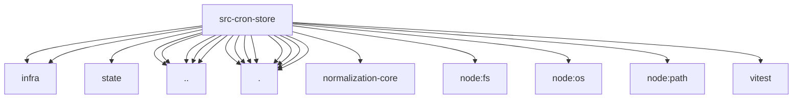

# Imports

[← Back to MODULE](MODULE.md) | [← Back to INDEX](../../INDEX.md)

## Dependency Graph

## External Dependencies

Dependencies from other modules:

- `../../infra/kysely-sync.js`
- `../../infra/sqlite-number.js`
- `../../state/openclaw-state-db.js`
- `../delivery.test-helpers.js`
- `../normalize-job-identity.js`
- `../normalize.js`
- `../persisted-shape.js`
- `../schedule-identity.js`
- `./delivery-codec.js`
- `./failure-alert-codec.js`
- `./payload-codec.js`
- `./row-codec.js`
- `./scalar-codec.js`
- `./schema.js`
- `./state-codec.js`
- `./trigger-codec.js`
- `@openclaw/normalization-core/record-coerce`
- `node:fs/promises`
- `node:os`
- `node:path`
- `vitest`
