# Imports

[← Back to MODULE](MODULE.md) | [← Back to INDEX](../../INDEX.md)

## Dependency Graph

```mermaid
graph TD
    src_fleet[src-fleet] --> config[config]
    src_fleet[src-fleet] --> infra[infra]
    src_fleet[src-fleet] --> infra[infra]
    src_fleet[src-fleet] --> infra[infra]
    src_fleet[src-fleet] --> process[process]
    src_fleet[src-fleet] --> process[process]
    src_fleet[src-fleet] --> state[state]
    src_fleet[src-fleet] --> state[state]
    src_fleet[src-fleet] --> state[state]
    src_fleet[src-fleet] --> state[state]
    src_fleet[src-fleet] --> test_helpers[test-helpers]
    src_fleet[src-fleet] --> __[..]
    src_fleet[src-fleet] --> _[.]
    src_fleet[src-fleet] --> _[.]
    src_fleet[src-fleet] --> _[.]
    src_fleet[src-fleet] --> _[.]
    src_fleet[src-fleet] --> _[.]
    src_fleet[src-fleet] --> _[.]
    src_fleet[src-fleet] --> _[.]
    src_fleet[src-fleet] --> _[.]
    src_fleet[src-fleet] --> json5[json5]
    src_fleet[src-fleet] --> node_child_process[node:child_process]
    src_fleet[src-fleet] --> node_crypto[node:crypto]
    src_fleet[src-fleet] --> node_fs[node:fs]
    src_fleet[src-fleet] --> node_fs[node:fs]
    src_fleet[src-fleet] --> node_net[node:net]
    src_fleet[src-fleet] --> node_os[node:os]
    src_fleet[src-fleet] --> node_path[node:path]
    src_fleet[src-fleet] --> node_stream[node:stream]
    src_fleet[src-fleet] --> node_string_decoder[node:string_decoder]
    src_fleet[src-fleet] --> vitest[vitest]
```

## External Dependencies

Dependencies from other modules:

- `../config/paths.js`
- `../infra/fs-safe.js`
- `../infra/kysely-sync.js`
- `../infra/replace-file.js`
- `../process/child-process-bridge.js`
- `../process/exec.js`
- `../state/openclaw-state-db-readonly.js`
- `../state/openclaw-state-db-schema-helpers.js`
- `../state/openclaw-state-db.js`
- `../state/openclaw-state-db.paths.js`
- `../test-helpers/temp-dir.js`
- `../utils.js`
- `./backup.runtime.js`
- `./cell-profile.js`
- `./containers.redaction.js`
- `./containers.runtime.js`
- `./doctor.runtime.js`
- `./registry.js`
- `./service-support.runtime.js`
- `./service.runtime.js`
- `json5`
- `node:child_process`
- `node:crypto`
- `node:fs`
- `node:fs/promises`
- `node:net`
- `node:os`
- `node:path`
- `node:stream/promises`
- `node:string_decoder`
- `vitest`
