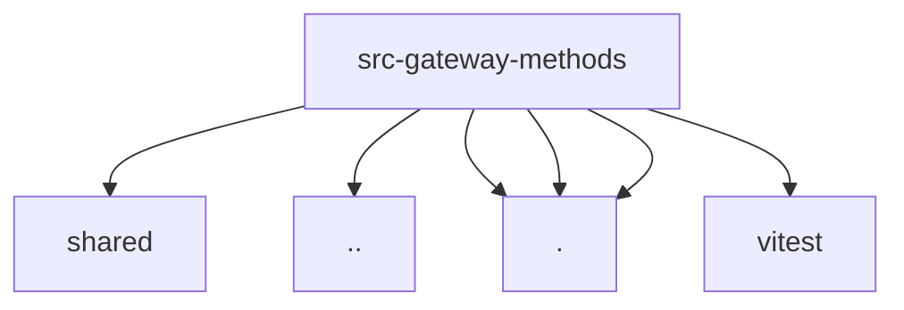

# Imports

[← Back to MODULE](MODULE.md) | [← Back to INDEX](../../INDEX.md)

## Dependency Graph

## External Dependencies

Dependencies from other modules:

- `../../shared/gateway-method-policy.js`
- `../operator-scopes.js`
- `./core-descriptors.js`
- `./descriptor.js`
- `./registry.js`
- `vitest`
