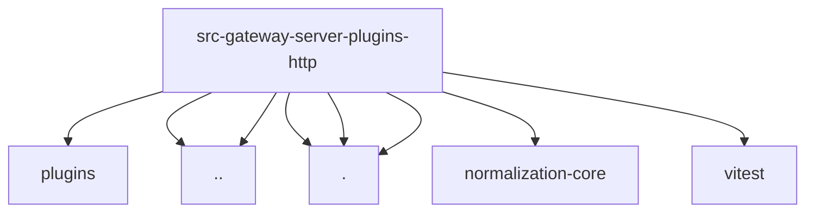

# Imports

[← Back to MODULE](MODULE.md) | [← Back to INDEX](../../INDEX.md)

## Dependency Graph

## External Dependencies

Dependencies from other modules:

- `../../../plugins/registry-empty.js`
- `../../plugin-node-capability.js`
- `../../security-path.js`
- `./path-context.js`
- `./route-capability.js`
- `./route-match.js`
- `@openclaw/normalization-core/string-coerce`
- `vitest`
