# Imports

[← Back to MODULE](MODULE.md) | [← Back to INDEX](../../INDEX.md)

## Dependency Graph

```mermaid
graph TD
    src_gateway_server_ws_connection[src-gateway-server-ws-connection] --> src[src]
    src_gateway_server_ws_connection[src-gateway-server-ws-connection] --> src[src]
    src_gateway_server_ws_connection[src-gateway-server-ws-connection] --> src[src]
    src_gateway_server_ws_connection[src-gateway-server-ws-connection] --> schema[schema]
    src_gateway_server_ws_connection[src-gateway-server-ws-connection] --> src[src]
    src_gateway_server_ws_connection[src-gateway-server-ws-connection] --> config[config]
    src_gateway_server_ws_connection[src-gateway-server-ws-connection] --> infra[infra]
    src_gateway_server_ws_connection[src-gateway-server-ws-connection] --> infra[infra]
    src_gateway_server_ws_connection[src-gateway-server-ws-connection] --> infra[infra]
    src_gateway_server_ws_connection[src-gateway-server-ws-connection] --> infra[infra]
    src_gateway_server_ws_connection[src-gateway-server-ws-connection] --> infra[infra]
    src_gateway_server_ws_connection[src-gateway-server-ws-connection] --> infra[infra]
    src_gateway_server_ws_connection[src-gateway-server-ws-connection] --> infra[infra]
    src_gateway_server_ws_connection[src-gateway-server-ws-connection] --> infra[infra]
    src_gateway_server_ws_connection[src-gateway-server-ws-connection] --> infra[infra]
    src_gateway_server_ws_connection[src-gateway-server-ws-connection] --> infra[infra]
    src_gateway_server_ws_connection[src-gateway-server-ws-connection] --> infra[infra]
    src_gateway_server_ws_connection[src-gateway-server-ws-connection] --> logging[logging]
    src_gateway_server_ws_connection[src-gateway-server-ws-connection] --> node_host[node-host]
    src_gateway_server_ws_connection[src-gateway-server-ws-connection] --> process[process]
    src_gateway_server_ws_connection[src-gateway-server-ws-connection] --> shared[shared]
    src_gateway_server_ws_connection[src-gateway-server-ws-connection] --> shared[shared]
    src_gateway_server_ws_connection[src-gateway-server-ws-connection] --> runtime[runtime]
    src_gateway_server_ws_connection[src-gateway-server-ws-connection] --> state[state]
    src_gateway_server_ws_connection[src-gateway-server-ws-connection] --> test_utils[test-utils]
    src_gateway_server_ws_connection[src-gateway-server-ws-connection] --> utils[utils]
    src_gateway_server_ws_connection[src-gateway-server-ws-connection] --> __[..]
    src_gateway_server_ws_connection[src-gateway-server-ws-connection] --> __[..]
    src_gateway_server_ws_connection[src-gateway-server-ws-connection] --> __[..]
    src_gateway_server_ws_connection[src-gateway-server-ws-connection] --> __[..]
    src_gateway_server_ws_connection[src-gateway-server-ws-connection] --> __[..]
    src_gateway_server_ws_connection[src-gateway-server-ws-connection] --> __[..]
    src_gateway_server_ws_connection[src-gateway-server-ws-connection] --> __[..]
    src_gateway_server_ws_connection[src-gateway-server-ws-connection] --> __[..]
    src_gateway_server_ws_connection[src-gateway-server-ws-connection] --> __[..]
    src_gateway_server_ws_connection[src-gateway-server-ws-connection] --> __[..]
    src_gateway_server_ws_connection[src-gateway-server-ws-connection] --> __[..]
    src_gateway_server_ws_connection[src-gateway-server-ws-connection] --> __[..]
    src_gateway_server_ws_connection[src-gateway-server-ws-connection] --> __[..]
    src_gateway_server_ws_connection[src-gateway-server-ws-connection] --> __[..]
    src_gateway_server_ws_connection[src-gateway-server-ws-connection] --> __[..]
    src_gateway_server_ws_connection[src-gateway-server-ws-connection] --> __[..]
    src_gateway_server_ws_connection[src-gateway-server-ws-connection] --> __[..]
    src_gateway_server_ws_connection[src-gateway-server-ws-connection] --> __[..]
    src_gateway_server_ws_connection[src-gateway-server-ws-connection] --> __[..]
    src_gateway_server_ws_connection[src-gateway-server-ws-connection] --> __[..]
    src_gateway_server_ws_connection[src-gateway-server-ws-connection] --> __[..]
    src_gateway_server_ws_connection[src-gateway-server-ws-connection] --> __[..]
    src_gateway_server_ws_connection[src-gateway-server-ws-connection] --> __[..]
    src_gateway_server_ws_connection[src-gateway-server-ws-connection] --> __[..]
    src_gateway_server_ws_connection[src-gateway-server-ws-connection] --> __[..]
    src_gateway_server_ws_connection[src-gateway-server-ws-connection] --> __[..]
    src_gateway_server_ws_connection[src-gateway-server-ws-connection] --> __[..]
    src_gateway_server_ws_connection[src-gateway-server-ws-connection] --> __[..]
    src_gateway_server_ws_connection[src-gateway-server-ws-connection] --> _[.]
    src_gateway_server_ws_connection[src-gateway-server-ws-connection] --> _[.]
    src_gateway_server_ws_connection[src-gateway-server-ws-connection] --> _[.]
    src_gateway_server_ws_connection[src-gateway-server-ws-connection] --> _[.]
    src_gateway_server_ws_connection[src-gateway-server-ws-connection] --> _[.]
    src_gateway_server_ws_connection[src-gateway-server-ws-connection] --> _[.]
    src_gateway_server_ws_connection[src-gateway-server-ws-connection] --> _[.]
    src_gateway_server_ws_connection[src-gateway-server-ws-connection] --> _[.]
    src_gateway_server_ws_connection[src-gateway-server-ws-connection] --> _[.]
    src_gateway_server_ws_connection[src-gateway-server-ws-connection] --> _[.]
    src_gateway_server_ws_connection[src-gateway-server-ws-connection] --> _[.]
    src_gateway_server_ws_connection[src-gateway-server-ws-connection] --> _[.]
    src_gateway_server_ws_connection[src-gateway-server-ws-connection] --> _[.]
    src_gateway_server_ws_connection[src-gateway-server-ws-connection] --> _[.]
    src_gateway_server_ws_connection[src-gateway-server-ws-connection] --> _[.]
    src_gateway_server_ws_connection[src-gateway-server-ws-connection] --> _[.]
    src_gateway_server_ws_connection[src-gateway-server-ws-connection] --> _[.]
    src_gateway_server_ws_connection[src-gateway-server-ws-connection] --> _[.]
    src_gateway_server_ws_connection[src-gateway-server-ws-connection] --> _[.]
    src_gateway_server_ws_connection[src-gateway-server-ws-connection] --> _[.]
    src_gateway_server_ws_connection[src-gateway-server-ws-connection] --> _[.]
    src_gateway_server_ws_connection[src-gateway-server-ws-connection] --> normalization_core[normalization-core]
    src_gateway_server_ws_connection[src-gateway-server-ws-connection] --> normalization_core[normalization-core]
    src_gateway_server_ws_connection[src-gateway-server-ws-connection] --> normalization_core[normalization-core]
    src_gateway_server_ws_connection[src-gateway-server-ws-connection] --> node_os[node:os]
    src_gateway_server_ws_connection[src-gateway-server-ws-connection] --> vitest[vitest]
```

## External Dependencies

Dependencies from other modules:

- `../../../../packages/gateway-protocol/src/client-info.js`
- `../../../../packages/gateway-protocol/src/connect-error-details.js`
- `../../../../packages/gateway-protocol/src/index.js`
- `../../../../packages/gateway-protocol/src/schema/worker-inference.js`
- `../../../../packages/gateway-protocol/src/startup-unavailable.js`
- `../../../config/io.js`
- `../../../infra/crypto-digest.js`
- `../../../infra/device-bootstrap.js`
- `../../../infra/device-identity.js`
- `../../../infra/device-pairing.js`
- `../../../infra/diagnostic-events.js`
- `../../../infra/diagnostic-trace-context.js`
- `../../../infra/node-pairing.js`
- `../../../infra/system-presence.js`
- `../../../infra/voicewake-routing.js`
- `../../../infra/voicewake.js`
- `../../../infra/ws.js`
- `../../../logging/diagnostic-payload.js`
- `../../../node-host/config.js`
- `../../../process/gateway-work-admission.js`
- `../../../shared/device-bootstrap-profile.js`
- `../../../shared/operator-scope-compat.js`
- `../../../skills/runtime/remote.js`
- `../../../state/user-profiles.js`
- `../../../test-utils/openclaw-test-state.js`
- `../../../utils/message-channel.js`
- `../../../version.js`
- `../../agent-runtime-identity-token.js`
- `../../auth-rate-limit.js`
- `../../auth.js`
- `../../control-ui-plugin-tabs.js`
- `../../device-auth.js`
- `../../device-pairing-prune.js`
- `../../method-scopes.js`
- `../../net.js`
- `../../node-connect-reconcile.js`
- `../../node-connection-notifications.js`
- `../../node-legacy-protocol-filter.js`
- `../../node-pairing-auto-approve.js`
- `../../node-pairing-ssh-verify.js`
- `../../operator-approval-runtime-token.js`
- `../../origin-check.js`
- `../../plugin-node-capability.js`
- `../../rate-limit-attempt-serialization.js`
- `../../role-policy.js`
- `../../server-constants.js`
- `../../server-methods.js`
- `../../server-utils.js`
- `../../user-profiles-http-path.js`
- `../../ws-log.js`
- `../close-reason.js`
- `../health-state.js`
- `../ws-connection.test-helpers.js`
- `../ws-shared-generation.js`
- `./auth-context.js`
- `./auth-messages.js`
- `./authenticated-request-dispatch.js`
- `./connect-admission.js`
- `./connect-auth-security.js`
- `./connect-auth.js`
- `./connect-device-metadata.js`
- `./connect-device-pairing.js`
- `./connect-device-proof.js`
- `./connect-device-tokens.js`
- `./connect-existing-device.js`
- `./connect-hello.js`
- `./connect-node-pairing-ssh.js`
- `./connect-node-session.js`
- `./connect-policy.js`
- `./connect-session.js`
- `./handshake-auth-helpers.js`
- `./handshake-auth-log-limiter.js`
- `./message-handler.js`
- `./unauthorized-flood-guard.js`
- `./worker-connection.js`
- `@openclaw/normalization-core/number-coercion`
- `@openclaw/normalization-core/string-coerce`
- `@openclaw/normalization-core/string-normalization`
- `node:os`
- `vitest`
