# Imports

[← Back to MODULE](MODULE.md) | [← Back to INDEX](../../INDEX.md)

## Dependency Graph

```mermaid
graph TD
    src_gateway_server[src-gateway-server] --> src[src]
    src_gateway_server[src-gateway-server] --> src[src]
    src_gateway_server[src-gateway-server] --> src[src]
    src_gateway_server[src-gateway-server] --> agents[agents]
    src_gateway_server[src-gateway-server] --> reply[reply]
    src_gateway_server[src-gateway-server] --> commands[commands]
    src_gateway_server[src-gateway-server] --> config[config]
    src_gateway_server[src-gateway-server] --> config[config]
    src_gateway_server[src-gateway-server] --> config[config]
    src_gateway_server[src-gateway-server] --> config[config]
    src_gateway_server[src-gateway-server] --> isolated_agent[isolated-agent]
    src_gateway_server[src-gateway-server] --> infra[infra]
    src_gateway_server[src-gateway-server] --> infra[infra]
    src_gateway_server[src-gateway-server] --> infra[infra]
    src_gateway_server[src-gateway-server] --> infra[infra]
    src_gateway_server[src-gateway-server] --> infra[infra]
    src_gateway_server[src-gateway-server] --> infra[infra]
    src_gateway_server[src-gateway-server] --> tls[tls]
    src_gateway_server[src-gateway-server] --> infra[infra]
    src_gateway_server[src-gateway-server] --> logging[logging]
    src_gateway_server[src-gateway-server] --> plugin_sdk[plugin-sdk]
    src_gateway_server[src-gateway-server] --> plugins[plugins]
    src_gateway_server[src-gateway-server] --> plugins[plugins]
    src_gateway_server[src-gateway-server] --> plugins[plugins]
    src_gateway_server[src-gateway-server] --> runtime[runtime]
    src_gateway_server[src-gateway-server] --> process[process]
    src_gateway_server[src-gateway-server] --> routing[routing]
    src_gateway_server[src-gateway-server] --> security[security]
    src_gateway_server[src-gateway-server] --> security[security]
    src_gateway_server[src-gateway-server] --> runtime[runtime]
    src_gateway_server[src-gateway-server] --> test_utils[test-utils]
    src_gateway_server[src-gateway-server] --> __[..]
    src_gateway_server[src-gateway-server] --> utils[utils]
    src_gateway_server[src-gateway-server] --> utils[utils]
    src_gateway_server[src-gateway-server] --> __[..]
    src_gateway_server[src-gateway-server] --> __[..]
    src_gateway_server[src-gateway-server] --> __[..]
    src_gateway_server[src-gateway-server] --> __[..]
    src_gateway_server[src-gateway-server] --> __[..]
    src_gateway_server[src-gateway-server] --> __[..]
    src_gateway_server[src-gateway-server] --> __[..]
    src_gateway_server[src-gateway-server] --> __[..]
    src_gateway_server[src-gateway-server] --> __[..]
    src_gateway_server[src-gateway-server] --> __[..]
    src_gateway_server[src-gateway-server] --> __[..]
    src_gateway_server[src-gateway-server] --> __[..]
    src_gateway_server[src-gateway-server] --> __[..]
    src_gateway_server[src-gateway-server] --> __[..]
    src_gateway_server[src-gateway-server] --> __[..]
    src_gateway_server[src-gateway-server] --> server_methods[server-methods]
    src_gateway_server[src-gateway-server] --> server_methods[server-methods]
    src_gateway_server[src-gateway-server] --> __[..]
    src_gateway_server[src-gateway-server] --> __[..]
    src_gateway_server[src-gateway-server] --> __[..]
    src_gateway_server[src-gateway-server] --> __tests__[__tests__]
    src_gateway_server[src-gateway-server] --> _[.]
    src_gateway_server[src-gateway-server] --> _[.]
    src_gateway_server[src-gateway-server] --> _[.]
    src_gateway_server[src-gateway-server] --> _[.]
    src_gateway_server[src-gateway-server] --> _[.]
    src_gateway_server[src-gateway-server] --> _[.]
    src_gateway_server[src-gateway-server] --> _[.]
    src_gateway_server[src-gateway-server] --> _[.]
    src_gateway_server[src-gateway-server] --> plugins_http[plugins-http]
    src_gateway_server[src-gateway-server] --> plugins_http[plugins-http]
    src_gateway_server[src-gateway-server] --> plugins_http[plugins-http]
    src_gateway_server[src-gateway-server] --> _[.]
    src_gateway_server[src-gateway-server] --> _[.]
    src_gateway_server[src-gateway-server] --> _[.]
    src_gateway_server[src-gateway-server] --> _[.]
    src_gateway_server[src-gateway-server] --> _[.]
    src_gateway_server[src-gateway-server] --> ws_connection[ws-connection]
    src_gateway_server[src-gateway-server] --> ws_connection[ws-connection]
    src_gateway_server[src-gateway-server] --> _[.]
    src_gateway_server[src-gateway-server] --> _[.]
    src_gateway_server[src-gateway-server] --> normalization_core[normalization-core]
    src_gateway_server[src-gateway-server] --> normalization_core[normalization-core]
    src_gateway_server[src-gateway-server] --> normalization_core[normalization-core]
    src_gateway_server[src-gateway-server] --> node_crypto[node:crypto]
    src_gateway_server[src-gateway-server] --> node_events[node:events]
    src_gateway_server[src-gateway-server] --> node_http[node:http]
    src_gateway_server[src-gateway-server] --> node_perf_hooks[node:perf_hooks]
    src_gateway_server[src-gateway-server] --> vitest[vitest]
```

## External Dependencies

Dependencies from other modules:

- `../../../packages/gateway-protocol/src/client-info.js`
- `../../../packages/gateway-protocol/src/index.js`
- `../../../packages/gateway-protocol/src/startup-unavailable.js`
- `../../agents/agent-scope.js`
- `../../auto-reply/reply/inbound-text.js`
- `../../commands/health.js`
- `../../config/io.js`
- `../../config/paths.js`
- `../../config/runtime-snapshot.js`
- `../../config/sessions.js`
- `../../cron/isolated-agent/session-key.js`
- `../../infra/crypto-digest.js`
- `../../infra/gateway-lock.js`
- `../../infra/gateway-suspend-coordinator.js`
- `../../infra/heartbeat-wake.js`
- `../../infra/system-events.js`
- `../../infra/system-presence.js`
- `../../infra/tls/gateway.js`
- `../../infra/update-startup.js`
- `../../logging/diagnostic-payload.js`
- `../../plugin-sdk/gateway-method-runtime.js`
- `../../plugins/http-registry.js`
- `../../plugins/registry.js`
- `../../plugins/runtime.js`
- `../../plugins/runtime/gateway-request-scope.js`
- `../../process/gateway-work-admission.js`
- `../../routing/session-key.js`
- `../../security/external-content.js`
- `../../security/secret-equal.js`
- `../../skills/runtime/remote.js`
- `../../test-utils/env.js`
- `../../utils.js`
- `../../utils/message-channel.js`
- `../../utils/utf8-truncate.js`
- `../auth-rate-limit.js`
- `../auth.js`
- `../channel-health-policy.js`
- `../control-ui-plugin-auth-cookie.js`
- `../exec-approval-manager.js`
- `../handshake-timeouts.js`
- `../hooks-mapping.js`
- `../hooks.js`
- `../hosted-plugin-surface-url.js`
- `../http-auth-utils.js`
- `../http-common.js`
- `../method-scopes.js`
- `../net.js`
- `../plugin-node-capability.js`
- `../server-constants.js`
- `../server-methods/approval-shared.js`
- `../server-methods/nodes-wake-state.js`
- `../server-utils.js`
- `../test-http-response.js`
- `../ws-log.js`
- `./__tests__/test-utils.js`
- `./close-reason.js`
- `./event-loop-health.js`
- `./health-state.js`
- `./hooks-request-handler.js`
- `./http-listen.js`
- `./http-work-admission.js`
- `./plugin-route-runtime-scopes.js`
- `./plugins-http.js`
- `./plugins-http/path-context.js`
- `./plugins-http/route-auth.js`
- `./plugins-http/route-match.js`
- `./preauth-connection-budget.js`
- `./presence-events.js`
- `./readiness.js`
- `./ws-connection.js`
- `./ws-connection.test-helpers.js`
- `./ws-connection/handshake-auth-log-limiter.js`
- `./ws-connection/worker-connection.js`
- `./ws-shared-generation.js`
- `./ws-types.js`
- `@openclaw/normalization-core/number-coercion`
- `@openclaw/normalization-core/string-coerce`
- `@openclaw/normalization-core/utf16-slice`
- `node:crypto`
- `node:events`
- `node:http`
- `node:perf_hooks`
- `vitest`
