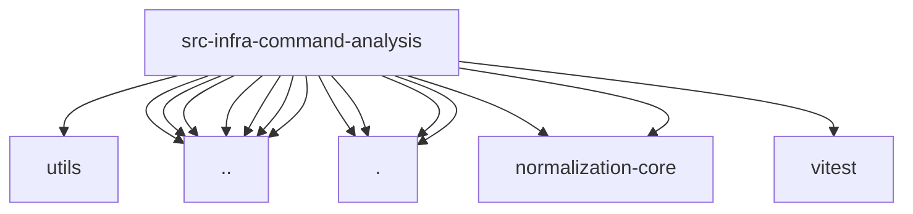

# Imports

[← Back to MODULE](MODULE.md) | [← Back to INDEX](../../INDEX.md)

## Dependency Graph

## External Dependencies

Dependencies from other modules:

- `../../utils/shell-argv.js`
- `../command-carriers.js`
- `../dispatch-wrapper-resolution.js`
- `../exec-approvals-analysis.js`
- `../exec-wrapper-resolution.js`
- `../parse-finite-number.js`
- `../shell-inline-command.js`
- `../shell-wrapper-resolution.js`
- `./explain.js`
- `./inline-eval.js`
- `./policy.js`
- `./risks.js`
- `@openclaw/normalization-core/string-coerce`
- `@openclaw/normalization-core/string-normalization`
- `vitest`
