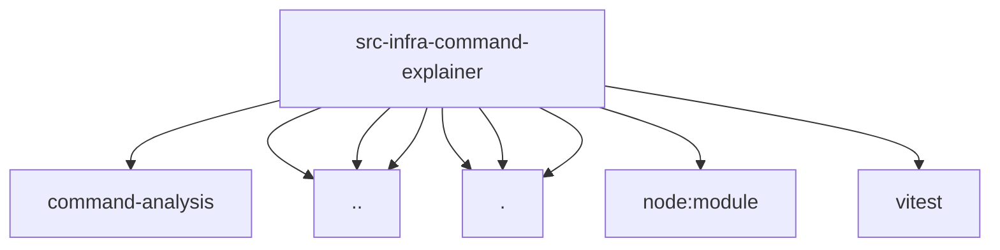

# Imports

[← Back to MODULE](MODULE.md) | [← Back to INDEX](../../INDEX.md)

## Dependency Graph

## External Dependencies

Dependencies from other modules:

- `../command-analysis/risks.js`
- `../exec-wrapper-resolution.js`
- `../exec-wrapper-tokens.js`
- `../shell-wrapper-resolution.js`
- `./extract.js`
- `./format.js`
- `./tree-sitter-runtime.js`
- `node:module`
- `vitest`
