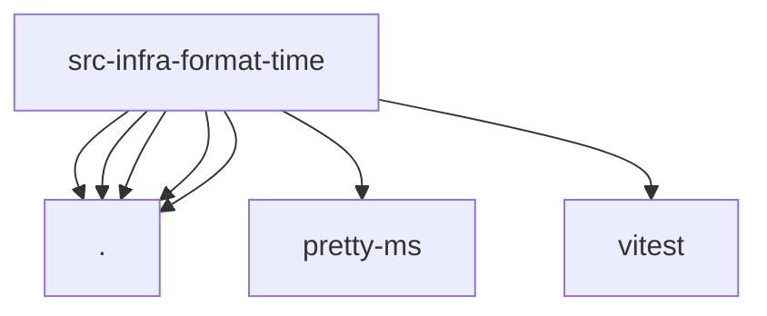

# Imports

[← Back to MODULE](MODULE.md) | [← Back to INDEX](../../INDEX.md)

## Dependency Graph

## External Dependencies

Dependencies from other modules:

- `./format-datetime.js`
- `./format-duration-internal.js`
- `./format-duration.js`
- `./format-relative.js`
- `./parse-offsetless-zoned-datetime.js`
- `pretty-ms`
- `vitest`
