# Imports

[← Back to MODULE](MODULE.md) | [← Back to INDEX](../../INDEX.md)

## Dependency Graph

```mermaid
graph TD
    src_link_understanding[src-link-understanding] --> reply[reply]
    src_link_understanding[src-link-understanding] --> auto_reply[auto-reply]
    src_link_understanding[src-link-understanding] --> __[..]
    src_link_understanding[src-link-understanding] --> infra[infra]
    src_link_understanding[src-link-understanding] --> net[net]
    src_link_understanding[src-link-understanding] --> net[net]
    src_link_understanding[src-link-understanding] --> media_understanding[media-understanding]
    src_link_understanding[src-link-understanding] --> media_understanding[media-understanding]
    src_link_understanding[src-link-understanding] --> media_understanding[media-understanding]
    src_link_understanding[src-link-understanding] --> process[process]
    src_link_understanding[src-link-understanding] --> _[.]
    src_link_understanding[src-link-understanding] --> _[.]
    src_link_understanding[src-link-understanding] --> _[.]
    src_link_understanding[src-link-understanding] --> _[.]
    src_link_understanding[src-link-understanding] --> normalization_core[normalization-core]
    src_link_understanding[src-link-understanding] --> vitest[vitest]
```

## External Dependencies

Dependencies from other modules:

- `../auto-reply/reply/inbound-context.js`
- `../auto-reply/templating.js`
- `../globals.js`
- `../infra/http-body.js`
- `../infra/net/fetch-guard.js`
- `../infra/net/ssrf.js`
- `../media-understanding/defaults.js`
- `../media-understanding/resolve.js`
- `../media-understanding/scope.js`
- `../process/exec.js`
- `./defaults.js`
- `./detect.js`
- `./format.js`
- `./runner.js`
- `@openclaw/normalization-core/string-normalization`
- `vitest`
