# Imports

[← Back to MODULE](MODULE.md) | [← Back to INDEX](../../INDEX.md)

## Dependency Graph

```mermaid
graph TD
    src_llm_providers_stream_wrappers[src-llm-providers-stream-wrappers] --> agents[agents]
    src_llm_providers_stream_wrappers[src-llm-providers-stream-wrappers] --> agents[agents]
    src_llm_providers_stream_wrappers[src-llm-providers-stream-wrappers] --> agents[agents]
    src_llm_providers_stream_wrappers[src-llm-providers-stream-wrappers] --> agents[agents]
    src_llm_providers_stream_wrappers[src-llm-providers-stream-wrappers] --> agents[agents]
    src_llm_providers_stream_wrappers[src-llm-providers-stream-wrappers] --> agents[agents]
    src_llm_providers_stream_wrappers[src-llm-providers-stream-wrappers] --> agents[agents]
    src_llm_providers_stream_wrappers[src-llm-providers-stream-wrappers] --> agents[agents]
    src_llm_providers_stream_wrappers[src-llm-providers-stream-wrappers] --> agents[agents]
    src_llm_providers_stream_wrappers[src-llm-providers-stream-wrappers] --> infra[infra]
    src_llm_providers_stream_wrappers[src-llm-providers-stream-wrappers] --> logging[logging]
    src_llm_providers_stream_wrappers[src-llm-providers-stream-wrappers] --> plugin_sdk[plugin-sdk]
    src_llm_providers_stream_wrappers[src-llm-providers-stream-wrappers] --> shared[shared]
    src_llm_providers_stream_wrappers[src-llm-providers-stream-wrappers] --> __[..]
    src_llm_providers_stream_wrappers[src-llm-providers-stream-wrappers] --> _[.]
    src_llm_providers_stream_wrappers[src-llm-providers-stream-wrappers] --> _[.]
    src_llm_providers_stream_wrappers[src-llm-providers-stream-wrappers] --> _[.]
    src_llm_providers_stream_wrappers[src-llm-providers-stream-wrappers] --> _[.]
    src_llm_providers_stream_wrappers[src-llm-providers-stream-wrappers] --> _[.]
    src_llm_providers_stream_wrappers[src-llm-providers-stream-wrappers] --> _[.]
    src_llm_providers_stream_wrappers[src-llm-providers-stream-wrappers] --> _[.]
    src_llm_providers_stream_wrappers[src-llm-providers-stream-wrappers] --> _[.]
    src_llm_providers_stream_wrappers[src-llm-providers-stream-wrappers] --> _[.]
    src_llm_providers_stream_wrappers[src-llm-providers-stream-wrappers] --> internal[internal]
    src_llm_providers_stream_wrappers[src-llm-providers-stream-wrappers] --> normalization_core[normalization-core]
    src_llm_providers_stream_wrappers[src-llm-providers-stream-wrappers] --> normalization_core[normalization-core]
    src_llm_providers_stream_wrappers[src-llm-providers-stream-wrappers] --> plugin_sdk[plugin-sdk]
    src_llm_providers_stream_wrappers[src-llm-providers-stream-wrappers] --> vitest[vitest]
```

## Internal Dependencies

Dependencies within this module:

- `openai`

## External Dependencies

Dependencies from other modules:

- `../../../agents/codex-native-web-search-core.js`
- `../../../agents/live-test-helpers.js`
- `../../../agents/model-transport-debug.js`
- `../../../agents/openai-completions-string-content.js`
- `../../../agents/openai-responses-payload-policy.js`
- `../../../agents/openai-text-verbosity.js`
- `../../../agents/openai-transport-stream.js`
- `../../../agents/provider-attribution.js`
- `../../../agents/provider-request-config.js`
- `../../../infra/parse-finite-number.js`
- `../../../logging/subsystem.js`
- `../../../plugin-sdk/provider-stream-shared.js`
- `../../../shared/lazy-promise.js`
- `../../stream.js`
- `./anthropic-cache-control-payload.js`
- `./anthropic-family-cache-semantics.js`
- `./anthropic-family-tool-payload-compat.js`
- `./google.js`
- `./minimax.js`
- `./openai.js`
- `./proxy.js`
- `./reasoning-effort-utils.js`
- `./stream-payload-utils.js`
- `@openclaw/ai/internal/openai`
- `@openclaw/normalization-core/record-coerce`
- `@openclaw/normalization-core/string-coerce`
- `openclaw/plugin-sdk/llm`
- `vitest`
