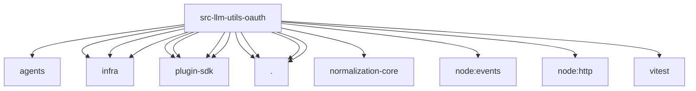

# Imports

[← Back to MODULE](MODULE.md) | [← Back to INDEX](../../INDEX.md)

## Dependency Graph

## External Dependencies

Dependencies from other modules:

- `../../../agents/provider-http-errors.js`
- `../../../infra/errors.js`
- `../../../infra/http-body.js`
- `../../../infra/parse-finite-number.js`
- `../../../plugin-sdk/facade-runtime.js`
- `../../../plugin-sdk/github-copilot-domain.js`
- `../../../plugin-sdk/github-copilot-token-endpoint.js`
- `../../../plugin-sdk/provider-oauth-runtime.js`
- `./abort.js`
- `./anthropic.js`
- `./github-copilot.js`
- `./openai-chatgpt.js`
- `@openclaw/normalization-core/number-coercion`
- `node:events`
- `node:http`
- `vitest`
