# Imports

[← Back to MODULE](MODULE.md) | [← Back to INDEX](../../INDEX.md)

## Dependency Graph

```mermaid
graph TD
    src_mcp[src-mcp] --> agents[agents]
    src_mcp[src-mcp] --> agents[agents]
    src_mcp[src-mcp] --> harness[harness]
    src_mcp[src-mcp] --> agents[agents]
    src_mcp[src-mcp] --> agents[agents]
    src_mcp[src-mcp] --> tools[tools]
    src_mcp[src-mcp] --> tools[tools]
    src_mcp[src-mcp] --> config[config]
    src_mcp[src-mcp] --> infra[infra]
    src_mcp[src-mcp] --> infra[infra]
    src_mcp[src-mcp] --> logging[logging]
    src_mcp[src-mcp] --> plugins[plugins]
    src_mcp[src-mcp] --> plugins[plugins]
    src_mcp[src-mcp] --> plugins[plugins]
    src_mcp[src-mcp] --> plugins[plugins]
    src_mcp[src-mcp] --> plugins[plugins]
    src_mcp[src-mcp] --> routing[routing]
    src_mcp[src-mcp] --> shared[shared]
    src_mcp[src-mcp] --> shared[shared]
    src_mcp[src-mcp] --> __[..]
    src_mcp[src-mcp] --> _[.]
    src_mcp[src-mcp] --> _[.]
    src_mcp[src-mcp] --> _[.]
    src_mcp[src-mcp] --> _[.]
    src_mcp[src-mcp] --> _[.]
    src_mcp[src-mcp] --> _[.]
    src_mcp[src-mcp] --> _[.]
    src_mcp[src-mcp] --> _[.]
    src_mcp[src-mcp] --> _[.]
    src_mcp[src-mcp] --> _[.]
    src_mcp[src-mcp] --> _[.]
    src_mcp[src-mcp] --> client[client]
    src_mcp[src-mcp] --> sdk[sdk]
    src_mcp[src-mcp] --> server[server]
    src_mcp[src-mcp] --> server[server]
    src_mcp[src-mcp] --> server[server]
    src_mcp[src-mcp] --> sdk[sdk]
    src_mcp[src-mcp] --> normalization_core[normalization-core]
    src_mcp[src-mcp] --> normalization_core[normalization-core]
    src_mcp[src-mcp] --> normalization_core[normalization-core]
    src_mcp[src-mcp] --> node_crypto[node:crypto]
    src_mcp[src-mcp] --> node_fs[node:fs]
    src_mcp[src-mcp] --> node_module[node:module]
    src_mcp[src-mcp] --> node_path[node:path]
    src_mcp[src-mcp] --> node_url[node:url]
    src_mcp[src-mcp] --> vitest[vitest]
    src_mcp[src-mcp] --> zod[zod]
```

## External Dependencies

Dependencies from other modules:

- `../agents/agent-tools.before-tool-call.js`
- `../agents/agent-tools.before-tool-call.state.js`
- `../agents/harness/registry.js`
- `../agents/sandbox-tool-policy.js`
- `../agents/tool-policy.js`
- `../agents/tools/cron-tool.js`
- `../agents/tools/system-agent-tool.js`
- `../config/config.js`
- `../infra/errors.js`
- `../infra/openclaw-root.js`
- `../logging/console.js`
- `../plugins/config-state.js`
- `../plugins/hook-runner-global.js`
- `../plugins/hooks.test-fixtures.js`
- `../plugins/tools.js`
- `../plugins/types.js`
- `../routing/session-key.js`
- `../shared/chat-content.js`
- `../shared/chat-message-content.js`
- `../version.js`
- `./agent-session-env.js`
- `./channel-bridge.js`
- `./channel-server-runtime.js`
- `./channel-shared.js`
- `./channel-tools.js`
- `./codex-supervision-tools-serve.js`
- `./openclaw-tools-serve-config.js`
- `./openclaw-tools-serve.js`
- `./plugin-tools-handlers.js`
- `./plugin-tools-serve.js`
- `./tools-stdio-server.js`
- `@modelcontextprotocol/sdk/client/index.js`
- `@modelcontextprotocol/sdk/inMemory.js`
- `@modelcontextprotocol/sdk/server/index.js`
- `@modelcontextprotocol/sdk/server/mcp.js`
- `@modelcontextprotocol/sdk/server/stdio.js`
- `@modelcontextprotocol/sdk/types.js`
- `@openclaw/normalization-core/number-coercion`
- `@openclaw/normalization-core/record-coerce`
- `@openclaw/normalization-core/string-coerce`
- `node:crypto`
- `node:fs`
- `node:module`
- `node:path`
- `node:url`
- `vitest`
- `zod`
