# Imports

[← Back to MODULE](MODULE.md) | [← Back to INDEX](../../INDEX.md)

## Dependency Graph

```mermaid
graph TD
    src_meeting_bot[src-meeting-bot] --> cli[cli]
    src_meeting_bot[src-meeting-bot] --> infra[infra]
    src_meeting_bot[src-meeting-bot] --> realtime_transcription[realtime-transcription]
    src_meeting_bot[src-meeting-bot] --> routing[routing]
    src_meeting_bot[src-meeting-bot] --> talk[talk]
    src_meeting_bot[src-meeting-bot] --> talk[talk]
    src_meeting_bot[src-meeting-bot] --> talk[talk]
    src_meeting_bot[src-meeting-bot] --> talk[talk]
    src_meeting_bot[src-meeting-bot] --> talk[talk]
    src_meeting_bot[src-meeting-bot] --> talk[talk]
    src_meeting_bot[src-meeting-bot] --> talk[talk]
    src_meeting_bot[src-meeting-bot] --> __[..]
    src_meeting_bot[src-meeting-bot] --> utils[utils]
    src_meeting_bot[src-meeting-bot] --> _[.]
    src_meeting_bot[src-meeting-bot] --> _[.]
    src_meeting_bot[src-meeting-bot] --> _[.]
    src_meeting_bot[src-meeting-bot] --> _[.]
    src_meeting_bot[src-meeting-bot] --> _[.]
    src_meeting_bot[src-meeting-bot] --> _[.]
    src_meeting_bot[src-meeting-bot] --> _[.]
    src_meeting_bot[src-meeting-bot] --> _[.]
    src_meeting_bot[src-meeting-bot] --> _[.]
    src_meeting_bot[src-meeting-bot] --> _[.]
    src_meeting_bot[src-meeting-bot] --> _[.]
    src_meeting_bot[src-meeting-bot] --> _[.]
    src_meeting_bot[src-meeting-bot] --> _[.]
    src_meeting_bot[src-meeting-bot] --> normalization_core[normalization-core]
    src_meeting_bot[src-meeting-bot] --> normalization_core[normalization-core]
    src_meeting_bot[src-meeting-bot] --> normalization_core[normalization-core]
    src_meeting_bot[src-meeting-bot] --> node_child_process[node:child_process]
    src_meeting_bot[src-meeting-bot] --> node_crypto[node:crypto]
    src_meeting_bot[src-meeting-bot] --> node_timers[node:timers]
    src_meeting_bot[src-meeting-bot] --> vitest[vitest]
```

## External Dependencies

Dependencies from other modules:

- `../cli/gateway-rpc.js`
- `../infra/errors.js`
- `../realtime-transcription/provider-registry.js`
- `../routing/session-key.js`
- `../talk/agent-consult-runtime.js`
- `../talk/agent-consult-tool.js`
- `../talk/audio-codec.js`
- `../talk/audio-energy.js`
- `../talk/provider-resolver.js`
- `../talk/provider-types.js`
- `../talk/realtime-session-harness.js`
- `../utils.js`
- `../utils/sleep.js`
- `./bridge-process.js`
- `./browser-act-lock.js`
- `./browser-controller.js`
- `./browser-navigation-errors.js`
- `./browser-request.js`
- `./browser-session-control.js`
- `./node-audio-pull-waiters.js`
- `./realtime-audio-format.js`
- `./realtime-engine.js`
- `./session-cleanup-tracker.js`
- `./session-join-lock.js`
- `./session-runtime.js`
- `./session-transcript-store.js`
- `@openclaw/normalization-core/number-coercion`
- `@openclaw/normalization-core/string-coerce`
- `@openclaw/normalization-core/string-normalization`
- `node:child_process`
- `node:crypto`
- `node:timers/promises`
- `vitest`
