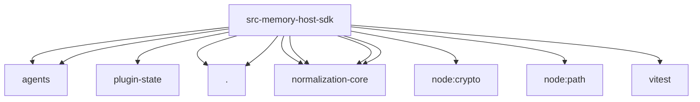

# Imports

[← Back to MODULE](MODULE.md) | [← Back to INDEX](../../INDEX.md)

## Dependency Graph

## External Dependencies

Dependencies from other modules:

- `../agents/agent-scope.js`
- `../agents/workspace-state-store.js`
- `../plugin-state/plugin-state-store.js`
- `./dreaming.js`
- `./event-store.js`
- `@openclaw/normalization-core/boolean-coercion`
- `@openclaw/normalization-core/number-coercion`
- `@openclaw/normalization-core/record-coerce`
- `@openclaw/normalization-core/string-coerce`
- `node:crypto`
- `node:path`
- `vitest`
