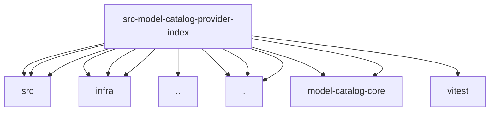

# Imports

[← Back to MODULE](MODULE.md) | [← Back to INDEX](../../INDEX.md)

## Dependency Graph

## External Dependencies

Dependencies from other modules:

- `../../../packages/normalization-core/src/number-coercion.js`
- `../../../packages/normalization-core/src/string-coerce.js`
- `../../../packages/normalization-core/src/string-normalization.js`
- `../../infra/clawhub-spec.js`
- `../../infra/npm-registry-spec.js`
- `../../infra/prototype-keys.js`
- `../../utils.js`
- `./index.js`
- `./normalize.js`
- `./openclaw-provider-index.js`
- `@openclaw/model-catalog-core/model-catalog-normalize`
- `@openclaw/model-catalog-core/model-catalog-refs`
- `vitest`
