# Imports

[← Back to MODULE](MODULE.md) | [← Back to INDEX](../../INDEX.md)

## Dependency Graph

```mermaid
graph TD
    src_music_generation[src-music-generation] --> src[src]
    src_music_generation[src-music-generation] --> config[config]
    src_music_generation[src-music-generation] --> infra[infra]
    src_music_generation[src-music-generation] --> logging[logging]
    src_music_generation[src-music-generation] --> media_generation[media-generation]
    src_music_generation[src-music-generation] --> media_generation[media-generation]
    src_music_generation[src-music-generation] --> media_understanding[media-understanding]
    src_music_generation[src-music-generation] --> plugins[plugins]
    src_music_generation[src-music-generation] --> plugins[plugins]
    src_music_generation[src-music-generation] --> secrets[secrets]
    src_music_generation[src-music-generation] --> _[.]
    src_music_generation[src-music-generation] --> _[.]
    src_music_generation[src-music-generation] --> _[.]
    src_music_generation[src-music-generation] --> _[.]
    src_music_generation[src-music-generation] --> _[.]
    src_music_generation[src-music-generation] --> media_core[media-core]
    src_music_generation[src-music-generation] --> media_core[media-core]
    src_music_generation[src-music-generation] --> normalization_core[normalization-core]
    src_music_generation[src-music-generation] --> normalization_core[normalization-core]
    src_music_generation[src-music-generation] --> vitest[vitest]
```

## External Dependencies

Dependencies from other modules:

- `../../packages/media-generation-core/src/model-ref.js`
- `../config/model-input.js`
- `../infra/http-body.js`
- `../logging/subsystem.js`
- `../media-generation/live-test-helpers.js`
- `../media-generation/runtime-shared.js`
- `../media-understanding/shared.js`
- `../plugins/capability-provider-runtime.js`
- `../plugins/provider-registry-shared.js`
- `../secrets/provider-env-vars.js`
- `./capabilities.js`
- `./model-ref.js`
- `./normalization.js`
- `./provider-registry.js`
- `./runtime.js`
- `@openclaw/media-core/constants`
- `@openclaw/media-core/mime`
- `@openclaw/normalization-core/record-coerce`
- `@openclaw/normalization-core/string-coerce`
- `vitest`
