# Imports

[← Back to MODULE](MODULE.md) | [← Back to INDEX](../../INDEX.md)

## Dependency Graph

```mermaid
graph TD
    src_pairing[src-pairing] --> plugins[plugins]
    src_pairing[src-pairing] --> cli[cli]
    src_pairing[src-pairing] --> config[config]
    src_pairing[src-pairing] --> config[config]
    src_pairing[src-pairing] --> gateway[gateway]
    src_pairing[src-pairing] --> gateway[gateway]
    src_pairing[src-pairing] --> infra[infra]
    src_pairing[src-pairing] --> infra[infra]
    src_pairing[src-pairing] --> infra[infra]
    src_pairing[src-pairing] --> infra[infra]
    src_pairing[src-pairing] --> infra[infra]
    src_pairing[src-pairing] --> plugins[plugins]
    src_pairing[src-pairing] --> plugins[plugins]
    src_pairing[src-pairing] --> routing[routing]
    src_pairing[src-pairing] --> routing[routing]
    src_pairing[src-pairing] --> shared[shared]
    src_pairing[src-pairing] --> shared[shared]
    src_pairing[src-pairing] --> shared[shared]
    src_pairing[src-pairing] --> state[state]
    src_pairing[src-pairing] --> test_utils[test-utils]
    src_pairing[src-pairing] --> _[.]
    src_pairing[src-pairing] --> _[.]
    src_pairing[src-pairing] --> _[.]
    src_pairing[src-pairing] --> _[.]
    src_pairing[src-pairing] --> _[.]
    src_pairing[src-pairing] --> _[.]
    src_pairing[src-pairing] --> net_policy[net-policy]
    src_pairing[src-pairing] --> normalization_core[normalization-core]
    src_pairing[src-pairing] --> normalization_core[normalization-core]
    src_pairing[src-pairing] --> normalization_core[normalization-core]
    src_pairing[src-pairing] --> node_crypto[node:crypto]
    src_pairing[src-pairing] --> node_fs[node:fs]
    src_pairing[src-pairing] --> node_os[node:os]
    src_pairing[src-pairing] --> node_path[node:path]
    src_pairing[src-pairing] --> plugin_sdk[plugin-sdk]
    src_pairing[src-pairing] --> vitest[vitest]
```

## External Dependencies

Dependencies from other modules:

- `../channels/plugins/pairing.js`
- `../cli/command-format.js`
- `../config/paths.js`
- `../config/types.secrets.js`
- `../gateway/auth-config-utils.js`
- `../gateway/auth-mode-policy.js`
- `../infra/advertised-lan-host.js`
- `../infra/device-bootstrap.js`
- `../infra/home-dir.js`
- `../infra/kysely-sync.js`
- `../infra/network-interfaces.js`
- `../plugins/hook-runner-global.js`
- `../plugins/hooks.test-fixtures.js`
- `../routing/account-id.js`
- `../routing/session-key.js`
- `../shared/device-bootstrap-profile.js`
- `../shared/gateway-bind-url.js`
- `../shared/tailscale-status.js`
- `../state/openclaw-state-db.js`
- `../test-utils/env.js`
- `./pairing-challenge.js`
- `./pairing-messages.js`
- `./pairing-store-keys.js`
- `./pairing-store-sqlite.js`
- `./pairing-store-sqlite.test-helpers.js`
- `./pairing-store.js`
- `@openclaw/net-policy/ip`
- `@openclaw/normalization-core/record-coerce`
- `@openclaw/normalization-core/string-coerce`
- `@openclaw/normalization-core/string-normalization`
- `node:crypto`
- `node:fs`
- `node:os`
- `node:path`
- `openclaw/plugin-sdk/channel-test-helpers`
- `vitest`
