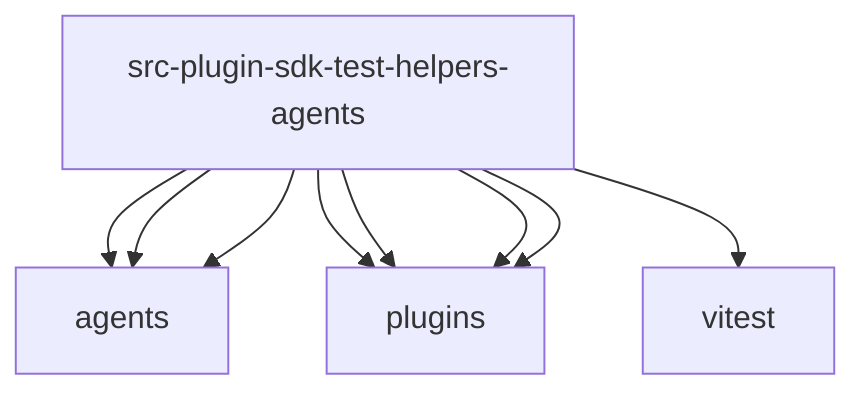

# Imports

[← Back to MODULE](MODULE.md) | [← Back to INDEX](../../INDEX.md)

## Dependency Graph

## External Dependencies

Dependencies from other modules:

- `../../../agents/agent-tools.before-tool-call.state.js`
- `../../../agents/provider-auth-aliases.js`
- `../../../agents/tool-terminal-presentation.js`
- `../../../plugins/hook-runner-global.js`
- `../../../plugins/hooks.test-helpers.js`
- `../../../plugins/registry-empty.js`
- `../../../plugins/runtime.js`
- `vitest`
