# Imports

[← Back to MODULE](MODULE.md) | [← Back to INDEX](../../INDEX.md)

## Dependency Graph

```mermaid
graph TD
    src_process_supervisor_adapters[src-process-supervisor-adapters] --> helpers[helpers]
    src_process_supervisor_adapters[src-process-supervisor-adapters] --> infra[infra]
    src_process_supervisor_adapters[src-process-supervisor-adapters] --> infra[infra]
    src_process_supervisor_adapters[src-process-supervisor-adapters] --> plugin_sdk[plugin-sdk]
    src_process_supervisor_adapters[src-process-supervisor-adapters] --> __[..]
    src_process_supervisor_adapters[src-process-supervisor-adapters] --> __[..]
    src_process_supervisor_adapters[src-process-supervisor-adapters] --> __[..]
    src_process_supervisor_adapters[src-process-supervisor-adapters] --> __[..]
    src_process_supervisor_adapters[src-process-supervisor-adapters] --> _[.]
    src_process_supervisor_adapters[src-process-supervisor-adapters] --> _[.]
    src_process_supervisor_adapters[src-process-supervisor-adapters] --> node_events[node:events]
    src_process_supervisor_adapters[src-process-supervisor-adapters] --> node_fs[node:fs]
    src_process_supervisor_adapters[src-process-supervisor-adapters] --> node_fs[node:fs]
    src_process_supervisor_adapters[src-process-supervisor-adapters] --> node_path[node:path]
    src_process_supervisor_adapters[src-process-supervisor-adapters] --> node_stream[node:stream]
    src_process_supervisor_adapters[src-process-supervisor-adapters] --> vitest[vitest]
```

## External Dependencies

Dependencies from other modules:

- `../../../../test/helpers/temp-dir.js`
- `../../../infra/errors.js`
- `../../../infra/windows-encoding.js`
- `../../../plugin-sdk/windows-spawn.js`
- `../../kill-tree.js`
- `../../linux-oom-score.js`
- `../../spawn-utils.js`
- `../../windows-command.js`
- `./env.js`
- `./test-support.js`
- `node:events`
- `node:fs`
- `node:fs/promises`
- `node:path`
- `node:stream`
- `vitest`
