# Imports

[← Back to MODULE](MODULE.md) | [← Back to INDEX](../../INDEX.md)

## Dependency Graph

```mermaid
graph TD
    src_skills_discovery[src-skills-discovery] --> helpers[helpers]
    src_skills_discovery[src-skills-discovery] --> agents[agents]
    src_skills_discovery[src-skills-discovery] --> agents[agents]
    src_skills_discovery[src-skills-discovery] --> utils[utils]
    src_skills_discovery[src-skills-discovery] --> auto_reply[auto-reply]
    src_skills_discovery[src-skills-discovery] --> __[..]
    src_skills_discovery[src-skills-discovery] --> infra[infra]
    src_skills_discovery[src-skills-discovery] --> logging[logging]
    src_skills_discovery[src-skills-discovery] --> plugins[plugins]
    src_skills_discovery[src-skills-discovery] --> routing[routing]
    src_skills_discovery[src-skills-discovery] --> shared[shared]
    src_skills_discovery[src-skills-discovery] --> test_utils[test-utils]
    src_skills_discovery[src-skills-discovery] --> __[..]
    src_skills_discovery[src-skills-discovery] --> lifecycle[lifecycle]
    src_skills_discovery[src-skills-discovery] --> loading[loading]
    src_skills_discovery[src-skills-discovery] --> loading[loading]
    src_skills_discovery[src-skills-discovery] --> loading[loading]
    src_skills_discovery[src-skills-discovery] --> loading[loading]
    src_skills_discovery[src-skills-discovery] --> loading[loading]
    src_skills_discovery[src-skills-discovery] --> runtime[runtime]
    src_skills_discovery[src-skills-discovery] --> runtime[runtime]
    src_skills_discovery[src-skills-discovery] --> test_support[test-support]
    src_skills_discovery[src-skills-discovery] --> test_support[test-support]
    src_skills_discovery[src-skills-discovery] --> _[.]
    src_skills_discovery[src-skills-discovery] --> _[.]
    src_skills_discovery[src-skills-discovery] --> _[.]
    src_skills_discovery[src-skills-discovery] --> _[.]
    src_skills_discovery[src-skills-discovery] --> _[.]
    src_skills_discovery[src-skills-discovery] --> _[.]
    src_skills_discovery[src-skills-discovery] --> normalization_core[normalization-core]
    src_skills_discovery[src-skills-discovery] --> normalization_core[normalization-core]
    src_skills_discovery[src-skills-discovery] --> node_fs[node:fs]
    src_skills_discovery[src-skills-discovery] --> node_fs[node:fs]
    src_skills_discovery[src-skills-discovery] --> node_os[node:os]
    src_skills_discovery[src-skills-discovery] --> node_path[node:path]
    src_skills_discovery[src-skills-discovery] --> vitest[vitest]
```

## External Dependencies

Dependencies from other modules:

- `../../../test/helpers/temp-dir.js`
- `../../agents/agent-scope.js`
- `../../agents/exec-defaults.js`
- `../../agents/utils/paths.js`
- `../../auto-reply/commands-registry.data.js`
- `../../globals.js`
- `../../infra/dedupe.js`
- `../../logging/subsystem.js`
- `../../plugins/bundle-commands.js`
- `../../routing/session-key.js`
- `../../shared/entry-status.js`
- `../../test-utils/env.js`
- `../../utils.js`
- `../lifecycle/clawhub.js`
- `../loading/bundled-context.js`
- `../loading/config.js`
- `../loading/frontmatter.js`
- `../loading/source.js`
- `../loading/workspace.js`
- `../runtime/remote-skills.js`
- `../runtime/remote.js`
- `../test-support/e2e-test-helpers.js`
- `../test-support/test-helpers.js`
- `./agent-filter.js`
- `./chat-command-invocation.js`
- `./command-specs.js`
- `./filter.js`
- `./skill-index.js`
- `./status.js`
- `@openclaw/normalization-core/string-coerce`
- `@openclaw/normalization-core/string-normalization`
- `node:fs`
- `node:fs/promises`
- `node:os`
- `node:path`
- `vitest`
