# Imports

[← Back to MODULE](MODULE.md) | [← Back to INDEX](../../INDEX.md)

## Dependency Graph

```mermaid
graph TD
    src_skills_loading[src-skills-loading] --> src[src]
    src_skills_loading[src-skills-loading] --> helpers[helpers]
    src_skills_loading[src-skills-loading] --> runtime[runtime]
    src_skills_loading[src-skills-loading] --> runtime[runtime]
    src_skills_loading[src-skills-loading] --> agents[agents]
    src_skills_loading[src-skills-loading] --> agents[agents]
    src_skills_loading[src-skills-loading] --> sessions[sessions]
    src_skills_loading[src-skills-loading] --> utils[utils]
    src_skills_loading[src-skills-loading] --> config[config]
    src_skills_loading[src-skills-loading] --> config[config]
    src_skills_loading[src-skills-loading] --> infra[infra]
    src_skills_loading[src-skills-loading] --> infra[infra]
    src_skills_loading[src-skills-loading] --> infra[infra]
    src_skills_loading[src-skills-loading] --> infra[infra]
    src_skills_loading[src-skills-loading] --> infra[infra]
    src_skills_loading[src-skills-loading] --> infra[infra]
    src_skills_loading[src-skills-loading] --> infra[infra]
    src_skills_loading[src-skills-loading] --> logging[logging]
    src_skills_loading[src-skills-loading] --> logging[logging]
    src_skills_loading[src-skills-loading] --> logging[logging]
    src_skills_loading[src-skills-loading] --> plugins[plugins]
    src_skills_loading[src-skills-loading] --> plugins[plugins]
    src_skills_loading[src-skills-loading] --> plugins[plugins]
    src_skills_loading[src-skills-loading] --> plugins[plugins]
    src_skills_loading[src-skills-loading] --> plugins[plugins]
    src_skills_loading[src-skills-loading] --> plugins[plugins]
    src_skills_loading[src-skills-loading] --> secrets[secrets]
    src_skills_loading[src-skills-loading] --> security[security]
    src_skills_loading[src-skills-loading] --> shared[shared]
    src_skills_loading[src-skills-loading] --> shared[shared]
    src_skills_loading[src-skills-loading] --> shared[shared]
    src_skills_loading[src-skills-loading] --> shared[shared]
    src_skills_loading[src-skills-loading] --> test_utils[test-utils]
    src_skills_loading[src-skills-loading] --> test_utils[test-utils]
    src_skills_loading[src-skills-loading] --> test_utils[test-utils]
    src_skills_loading[src-skills-loading] --> test_utils[test-utils]
    src_skills_loading[src-skills-loading] --> __[..]
    src_skills_loading[src-skills-loading] --> discovery[discovery]
    src_skills_loading[src-skills-loading] --> discovery[discovery]
    src_skills_loading[src-skills-loading] --> discovery[discovery]
    src_skills_loading[src-skills-loading] --> discovery[discovery]
    src_skills_loading[src-skills-loading] --> runtime[runtime]
    src_skills_loading[src-skills-loading] --> runtime[runtime]
    src_skills_loading[src-skills-loading] --> test_support[test-support]
    src_skills_loading[src-skills-loading] --> test_support[test-support]
    src_skills_loading[src-skills-loading] --> test_support[test-support]
    src_skills_loading[src-skills-loading] --> test_support[test-support]
    src_skills_loading[src-skills-loading] --> __[..]
    src_skills_loading[src-skills-loading] --> workshop[workshop]
    src_skills_loading[src-skills-loading] --> _[.]
    src_skills_loading[src-skills-loading] --> _[.]
    src_skills_loading[src-skills-loading] --> _[.]
    src_skills_loading[src-skills-loading] --> _[.]
    src_skills_loading[src-skills-loading] --> _[.]
    src_skills_loading[src-skills-loading] --> _[.]
    src_skills_loading[src-skills-loading] --> _[.]
    src_skills_loading[src-skills-loading] --> _[.]
    src_skills_loading[src-skills-loading] --> _[.]
    src_skills_loading[src-skills-loading] --> _[.]
    src_skills_loading[src-skills-loading] --> _[.]
    src_skills_loading[src-skills-loading] --> _[.]
    src_skills_loading[src-skills-loading] --> normalization_core[normalization-core]
    src_skills_loading[src-skills-loading] --> normalization_core[normalization-core]
    src_skills_loading[src-skills-loading] --> normalization_core[normalization-core]
    src_skills_loading[src-skills-loading] --> node_child_process[node:child_process]
    src_skills_loading[src-skills-loading] --> node_fs[node:fs]
    src_skills_loading[src-skills-loading] --> node_fs[node:fs]
    src_skills_loading[src-skills-loading] --> node_os[node:os]
    src_skills_loading[src-skills-loading] --> node_path[node:path]
    src_skills_loading[src-skills-loading] --> node_url[node:url]
    src_skills_loading[src-skills-loading] --> plugin_sdk[plugin-sdk]
    src_skills_loading[src-skills-loading] --> plugin_sdk[plugin-sdk]
    src_skills_loading[src-skills-loading] --> vitest[vitest]
```

## External Dependencies

Dependencies from other modules:

- `../../../packages/markdown-core/src/frontmatter.js`
- `../../../test/helpers/temp-dir.js`
- `../../acp/runtime/availability.js`
- `../../acp/runtime/registry.js`
- `../../agents/config.js`
- `../../agents/sandbox-paths.js`
- `../../agents/sessions/source-info.js`
- `../../agents/utils/paths.js`
- `../../config/runtime-snapshot.js`
- `../../config/types.secrets.js`
- `../../infra/boundary-file-read.js`
- `../../infra/crypto-digest.js`
- `../../infra/fs-safe.js`
- `../../infra/home-dir.js`
- `../../infra/npm-registry-spec.js`
- `../../infra/openclaw-root.js`
- `../../infra/path-guards.js`
- `../../logging/logger.js`
- `../../logging/state.js`
- `../../logging/subsystem.js`
- `../../plugins/config-policy.js`
- `../../plugins/current-plugin-metadata-snapshot.js`
- `../../plugins/installed-plugin-index-policy.js`
- `../../plugins/plugin-metadata-lifecycle.js`
- `../../plugins/plugin-metadata-snapshot.js`
- `../../plugins/slots.js`
- `../../secrets/runtime-degraded-state.js`
- `../../security/scan-paths.js`
- `../../shared/config-eval.js`
- `../../shared/frontmatter.js`
- `../../shared/ignore-rules.js`
- `../../shared/tilde-path.js`
- `../../test-utils/env.js`
- `../../test-utils/fixture-suite.js`
- `../../test-utils/temp-home.js`
- `../../test-utils/tracked-temp-dirs.js`
- `../../utils.js`
- `../discovery/agent-filter.js`
- `../discovery/command-specs.js`
- `../discovery/filter.js`
- `../discovery/skill-index.js`
- `../runtime/env-overrides.js`
- `../runtime/remote-skills.js`
- `../test-support/e2e-test-helpers.js`
- `../test-support/home-env.test-support.js`
- `../test-support/skill-plugin-fixtures.test-support.js`
- `../test-support/test-helpers.js`
- `../types.js`
- `../workshop/curator.js`
- `./bundled-dir.js`
- `./config.js`
- `./frontmatter.js`
- `./local-loader.js`
- `./plugin-skills.js`
- `./serialize.js`
- `./session.js`
- `./skill-contract.js`
- `./skill-version.js`
- `./source.js`
- `./symlink-targets.js`
- `./workspace.js`
- `@openclaw/normalization-core/string-coerce`
- `@openclaw/normalization-core/string-normalization`
- `@openclaw/normalization-core/utf16-slice`
- `node:child_process`
- `node:fs`
- `node:fs/promises`
- `node:os`
- `node:path`
- `node:url`
- `openclaw/plugin-sdk/agent-sessions`
- `openclaw/plugin-sdk/keyed-async-queue`
- `vitest`
