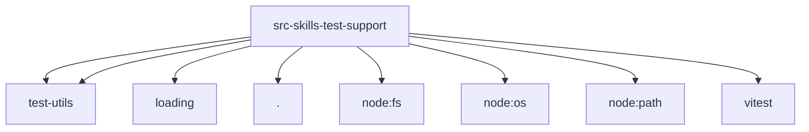

# Imports

[← Back to MODULE](MODULE.md) | [← Back to INDEX](../../INDEX.md)

## Dependency Graph

## External Dependencies

Dependencies from other modules:

- `../../test-utils/env.js`
- `../../test-utils/openclaw-test-state.js`
- `../loading/skill-contract.js`
- `./e2e-test-helpers.js`
- `node:fs/promises`
- `node:os`
- `node:path`
- `vitest`
