# Imports

[← Back to MODULE](MODULE.md) | [← Back to INDEX](../../INDEX.md)

## Dependency Graph

```mermaid
graph TD
    src_state[src-state] --> jobs[jobs]
    src_state[src-state] --> __[..]
    src_state[src-state] --> host[host]
    src_state[src-state] --> helpers[helpers]
    src_state[src-state] --> agents[agents]
    src_state[src-state] --> channels[channels]
    src_state[src-state] --> config[config]
    src_state[src-state] --> infra[infra]
    src_state[src-state] --> infra[infra]
    src_state[src-state] --> infra[infra]
    src_state[src-state] --> infra[infra]
    src_state[src-state] --> infra[infra]
    src_state[src-state] --> infra[infra]
    src_state[src-state] --> infra[infra]
    src_state[src-state] --> infra[infra]
    src_state[src-state] --> infra[infra]
    src_state[src-state] --> infra[infra]
    src_state[src-state] --> infra[infra]
    src_state[src-state] --> infra[infra]
    src_state[src-state] --> infra[infra]
    src_state[src-state] --> infra[infra]
    src_state[src-state] --> infra[infra]
    src_state[src-state] --> infra[infra]
    src_state[src-state] --> infra[infra]
    src_state[src-state] --> infra[infra]
    src_state[src-state] --> infra[infra]
    src_state[src-state] --> infra[infra]
    src_state[src-state] --> infra[infra]
    src_state[src-state] --> logging[logging]
    src_state[src-state] --> routing[routing]
    src_state[src-state] --> routing[routing]
    src_state[src-state] --> routing[routing]
    src_state[src-state] --> sessions[sessions]
    src_state[src-state] --> shared[shared]
    src_state[src-state] --> tasks[tasks]
    src_state[src-state] --> test_utils[test-utils]
    src_state[src-state] --> __[..]
    src_state[src-state] --> _[.]
    src_state[src-state] --> _[.]
    src_state[src-state] --> _[.]
    src_state[src-state] --> _[.]
    src_state[src-state] --> _[.]
    src_state[src-state] --> _[.]
    src_state[src-state] --> _[.]
    src_state[src-state] --> _[.]
    src_state[src-state] --> _[.]
    src_state[src-state] --> _[.]
    src_state[src-state] --> _[.]
    src_state[src-state] --> _[.]
    src_state[src-state] --> _[.]
    src_state[src-state] --> _[.]
    src_state[src-state] --> _[.]
    src_state[src-state] --> _[.]
    src_state[src-state] --> _[.]
    src_state[src-state] --> _[.]
    src_state[src-state] --> _[.]
    src_state[src-state] --> _[.]
    src_state[src-state] --> _[.]
    src_state[src-state] --> _[.]
    src_state[src-state] --> _[.]
    src_state[src-state] --> _[.]
    src_state[src-state] --> _[.]
    src_state[src-state] --> _[.]
    src_state[src-state] --> _[.]
    src_state[src-state] --> _[.]
    src_state[src-state] --> _[.]
    src_state[src-state] --> _[.]
    src_state[src-state] --> _[.]
    src_state[src-state] --> _[.]
    src_state[src-state] --> _[.]
    src_state[src-state] --> _[.]
    src_state[src-state] --> _[.]
    src_state[src-state] --> _[.]
    src_state[src-state] --> _[.]
    src_state[src-state] --> _[.]
    src_state[src-state] --> _[.]
    src_state[src-state] --> _[.]
    src_state[src-state] --> _[.]
    src_state[src-state] --> _[.]
    src_state[src-state] --> _[.]
    src_state[src-state] --> _[.]
    src_state[src-state] --> _[.]
    src_state[src-state] --> _[.]
    src_state[src-state] --> normalization_core[normalization-core]
    src_state[src-state] --> normalization_core[normalization-core]
    src_state[src-state] --> kysely[kysely]
    src_state[src-state] --> node_child_process[node:child_process]
    src_state[src-state] --> node_crypto[node:crypto]
    src_state[src-state] --> node_fs[node:fs]
    src_state[src-state] --> node_os[node:os]
    src_state[src-state] --> node_path[node:path]
    src_state[src-state] --> node_sqlite[node:sqlite]
    src_state[src-state] --> node_url[node:url]
    src_state[src-state] --> node_worker_threads[node:worker_threads]
    src_state[src-state] --> vitest[vitest]
    src_state[src-state] --> zod[zod]
```

## External Dependencies

Dependencies from other modules:

- `../../linkbots/lisa/ops/jobs/lisa-job-contracts.js`
- `../../package.json`
- `../../packages/memory-host-sdk/src/host/memory-schema.js`
- `../../test/helpers/temp-dir.js`
- `../agents/workspace-state-store.js`
- `../channels/chat-type.js`
- `../config/paths.js`
- `../infra/approval-resolution-ref.js`
- `../infra/backoff.js`
- `../infra/crypto-digest.js`
- `../infra/dedupe.js`
- `../infra/kysely-sync.js`
- `../infra/node-sqlite.js`
- `../infra/open-file-descriptors.test-support.js`
- `../infra/parse-finite-number.js`
- `../infra/private-mode.js`
- `../infra/secure-random.js`
- `../infra/sqlite-files.js`
- `../infra/sqlite-index-schema.js`
- `../infra/sqlite-integrity.js`
- `../infra/sqlite-pragma.test-support.js`
- `../infra/sqlite-schema-contract.js`
- `../infra/sqlite-strict.js`
- `../infra/sqlite-terminal-open-latch.js`
- `../infra/sqlite-transaction.js`
- `../infra/sqlite-user-version.js`
- `../infra/sqlite-wal.js`
- `../infra/state-migrations.cron-run-logs.js`
- `../logging/subsystem.js`
- `../routing/account-id.js`
- `../routing/conversation-ref.js`
- `../routing/session-key.js`
- `../sessions/session-chat-type-shared.js`
- `../shared/number-coercion.js`
- `../tasks/task-registry.store.sqlite.js`
- `../test-utils/openclaw-test-state.js`
- `../version.js`
- `./lisa-compliance-state-schema.js`
- `./lisa-compliance-state-store.js`
- `./lisa-job-state-schema.js`
- `./lisa-job-state-store.js`
- `./lisa-principal-task-helpers.js`
- `./lisa-principal-task-schema.js`
- `./lisa-principal-task-store.js`
- `./lisa-principal-task-types.js`
- `./lisa-principal-task-writes.js`
- `./lisa-stage-ops-schema.js`
- `./lisa-stage-ops-store.js`
- `./onboarding-recommendations.js`
- `./openclaw-agent-board-schema.js`
- `./openclaw-agent-db-contract.js`
- `./openclaw-agent-db-permissions.js`
- `./openclaw-agent-db-readonly.js`
- `./openclaw-agent-db-registry.js`
- `./openclaw-agent-db-schema-helpers.js`
- `./openclaw-agent-db-schema.js`
- `./openclaw-agent-db-session-migrations.js`
- `./openclaw-agent-db-session-provenance.js`
- `./openclaw-agent-db.js`
- `./openclaw-agent-db.paths.js`
- `./openclaw-agent-schema.generated.js`
- `./openclaw-database-preflight.js`
- `./openclaw-database-verify.impl.js`
- `./openclaw-database-verify.worker.js`
- `./openclaw-quarantine-store.js`
- `./openclaw-state-db-audit-migration.js`
- `./openclaw-state-db-contract.js`
- `./openclaw-state-db-legacy-backfills.js`
- `./openclaw-state-db-maintenance.js`
- `./openclaw-state-db-operator-approval-migration.js`
- `./openclaw-state-db-permissions.js`
- `./openclaw-state-db-readonly.js`
- `./openclaw-state-db-schema-additive.js`
- `./openclaw-state-db-schema-helpers.js`
- `./openclaw-state-db-schema-repair.js`
- `./openclaw-state-db.js`
- `./openclaw-state-db.paths.js`
- `./openclaw-state-lease.js`
- `./openclaw-state-schema.generated.js`
- `./session-watch-cursor-provenance.js`
- `./sqlite-schema-shape.test-support.js`
- `./user-profiles-schema.js`
- `./user-profiles.js`
- `@openclaw/normalization-core/record-coerce`
- `@openclaw/normalization-core/result`
- `kysely`
- `node:child_process`
- `node:crypto`
- `node:fs`
- `node:os`
- `node:path`
- `node:sqlite`
- `node:url`
- `node:worker_threads`
- `vitest`
- `zod`
