# Imports

[← Back to MODULE](MODULE.md) | [← Back to INDEX](../../INDEX.md)

## Dependency Graph

```mermaid
graph TD
    src_tasks[src-tasks] --> control_plane[control-plane]
    src_tasks[src-tasks] --> control_plane[control-plane]
    src_tasks[src-tasks] --> runtime[runtime]
    src_tasks[src-tasks] --> agents[agents]
    src_tasks[src-tasks] --> agents[agents]
    src_tasks[src-tasks] --> agents[agents]
    src_tasks[src-tasks] --> embedded_agent_helpers[embedded-agent-helpers]
    src_tasks[src-tasks] --> agents[agents]
    src_tasks[src-tasks] --> agents[agents]
    src_tasks[src-tasks] --> reply[reply]
    src_tasks[src-tasks] --> config[config]
    src_tasks[src-tasks] --> config[config]
    src_tasks[src-tasks] --> sessions[sessions]
    src_tasks[src-tasks] --> sessions[sessions]
    src_tasks[src-tasks] --> cron[cron]
    src_tasks[src-tasks] --> cron[cron]
    src_tasks[src-tasks] --> infra[infra]
    src_tasks[src-tasks] --> infra[infra]
    src_tasks[src-tasks] --> infra[infra]
    src_tasks[src-tasks] --> infra[infra]
    src_tasks[src-tasks] --> infra[infra]
    src_tasks[src-tasks] --> infra[infra]
    src_tasks[src-tasks] --> outbound[outbound]
    src_tasks[src-tasks] --> infra[infra]
    src_tasks[src-tasks] --> infra[infra]
    src_tasks[src-tasks] --> infra[infra]
    src_tasks[src-tasks] --> infra[infra]
    src_tasks[src-tasks] --> infra[infra]
    src_tasks[src-tasks] --> infra[infra]
    src_tasks[src-tasks] --> logging[logging]
    src_tasks[src-tasks] --> logging[logging]
    src_tasks[src-tasks] --> logging[logging]
    src_tasks[src-tasks] --> test_helpers[test-helpers]
    src_tasks[src-tasks] --> plugin_state[plugin-state]
    src_tasks[src-tasks] --> process[process]
    src_tasks[src-tasks] --> routing[routing]
    src_tasks[src-tasks] --> sessions[sessions]
    src_tasks[src-tasks] --> sessions[sessions]
    src_tasks[src-tasks] --> shared[shared]
    src_tasks[src-tasks] --> shared[shared]
    src_tasks[src-tasks] --> state[state]
    src_tasks[src-tasks] --> state[state]
    src_tasks[src-tasks] --> test_helpers[test-helpers]
    src_tasks[src-tasks] --> test_helpers[test-helpers]
    src_tasks[src-tasks] --> test_utils[test-utils]
    src_tasks[src-tasks] --> test_utils[test-utils]
    src_tasks[src-tasks] --> __[..]
    src_tasks[src-tasks] --> utils[utils]
    src_tasks[src-tasks] --> utils[utils]
    src_tasks[src-tasks] --> _[.]
    src_tasks[src-tasks] --> _[.]
    src_tasks[src-tasks] --> _[.]
    src_tasks[src-tasks] --> _[.]
    src_tasks[src-tasks] --> _[.]
    src_tasks[src-tasks] --> _[.]
    src_tasks[src-tasks] --> _[.]
    src_tasks[src-tasks] --> _[.]
    src_tasks[src-tasks] --> _[.]
    src_tasks[src-tasks] --> _[.]
    src_tasks[src-tasks] --> _[.]
    src_tasks[src-tasks] --> _[.]
    src_tasks[src-tasks] --> _[.]
    src_tasks[src-tasks] --> _[.]
    src_tasks[src-tasks] --> _[.]
    src_tasks[src-tasks] --> _[.]
    src_tasks[src-tasks] --> _[.]
    src_tasks[src-tasks] --> _[.]
    src_tasks[src-tasks] --> _[.]
    src_tasks[src-tasks] --> _[.]
    src_tasks[src-tasks] --> _[.]
    src_tasks[src-tasks] --> _[.]
    src_tasks[src-tasks] --> _[.]
    src_tasks[src-tasks] --> _[.]
    src_tasks[src-tasks] --> _[.]
    src_tasks[src-tasks] --> _[.]
    src_tasks[src-tasks] --> _[.]
    src_tasks[src-tasks] --> _[.]
    src_tasks[src-tasks] --> _[.]
    src_tasks[src-tasks] --> _[.]
    src_tasks[src-tasks] --> _[.]
    src_tasks[src-tasks] --> _[.]
    src_tasks[src-tasks] --> _[.]
    src_tasks[src-tasks] --> _[.]
    src_tasks[src-tasks] --> _[.]
    src_tasks[src-tasks] --> _[.]
    src_tasks[src-tasks] --> _[.]
    src_tasks[src-tasks] --> _[.]
    src_tasks[src-tasks] --> _[.]
    src_tasks[src-tasks] --> _[.]
    src_tasks[src-tasks] --> normalization_core[normalization-core]
    src_tasks[src-tasks] --> normalization_core[normalization-core]
    src_tasks[src-tasks] --> normalization_core[normalization-core]
    src_tasks[src-tasks] --> node_crypto[node:crypto]
    src_tasks[src-tasks] --> node_fs[node:fs]
    src_tasks[src-tasks] --> node_fs[node:fs]
    src_tasks[src-tasks] --> node_module[node:module]
    src_tasks[src-tasks] --> node_path[node:path]
    src_tasks[src-tasks] --> plugin_sdk[plugin-sdk]
    src_tasks[src-tasks] --> vitest[vitest]
```

## External Dependencies

Dependencies from other modules:

- `../acp/control-plane/active-turns.js`
- `../acp/control-plane/manager.js`
- `../acp/runtime/session-meta.js`
- `../agents/acp-spawn-parent-stream.js`
- `../agents/agent-run-terminal-outcome.js`
- `../agents/bash-process-control.js`
- `../agents/embedded-agent-helpers/sanitize-user-facing-text.js`
- `../agents/internal-runtime-context.js`
- `../agents/subagent-recovery-state.js`
- `../auto-reply/reply/completion-delivery-policy.js`
- `../config/config.js`
- `../config/sessions.js`
- `../config/sessions/paths.js`
- `../config/sessions/session-accessor.js`
- `../cron/active-jobs.js`
- `../cron/task-run-detail.js`
- `../infra/agent-events.js`
- `../infra/errors.js`
- `../infra/heartbeat-wake.js`
- `../infra/kysely-sync.js`
- `../infra/map-size.js`
- `../infra/node-sqlite.js`
- `../infra/outbound/session-binding-service.js`
- `../infra/session-delivery-queue.js`
- `../infra/sqlite-integrity.js`
- `../infra/sqlite-number.js`
- `../infra/sqlite-pragma.test-support.js`
- `../infra/sqlite-transaction.js`
- `../infra/system-events.js`
- `../logging/logger.js`
- `../logging/state.js`
- `../logging/subsystem.js`
- `../logging/test-helpers/warn-log-capture.js`
- `../plugin-state/plugin-state-store.js`
- `../process/gateway-work-admission.js`
- `../routing/session-key.js`
- `../sessions/session-chat-type-shared.js`
- `../sessions/session-key-utils.js`
- `../shared/global-singleton.js`
- `../shared/lazy-runtime.js`
- `../state/openclaw-state-db.js`
- `../state/openclaw-state-db.paths.js`
- `../test-helpers/state-dir-env.js`
- `../test-helpers/temp-dir.js`
- `../test-utils/env.js`
- `../test-utils/openclaw-test-state.js`
- `../utils.js`
- `../utils/delivery-context.shared.js`
- `../utils/message-channel.js`
- `./background-exec-task-contract.js`
- `./codex-native-subagent-task.js`
- `./cron-history-retention.js`
- `./cron-run-continuation-cleanup.js`
- `./detached-task-runtime-contract.js`
- `./detached-task-runtime-state.js`
- `./detached-task-runtime.js`
- `./generated-media-task-activity.js`
- `./import-boundary.test-helpers.js`
- `./native-subagent-task.js`
- `./runtime-internal.js`
- `./task-cancellation-state.js`
- `./task-completion-contract.js`
- `./task-domain-views.js`
- `./task-executor-policy.js`
- `./task-executor.js`
- `./task-flow-owner-access.js`
- `./task-flow-registry.audit.js`
- `./task-flow-registry.js`
- `./task-flow-registry.maintenance.js`
- `./task-flow-registry.store.js`
- `./task-flow-registry.store.sqlite.js`
- `./task-flow-registry.types.js`
- `./task-flow-runtime-internal.js`
- `./task-owner-access.js`
- `./task-registry-records.js`
- `./task-registry.audit.js`
- `./task-registry.audit.shared.js`
- `./task-registry.js`
- `./task-registry.maintenance.js`
- `./task-registry.process-state.js`
- `./task-registry.sqlite.shared.js`
- `./task-registry.store.js`
- `./task-registry.store.sqlite.js`
- `./task-registry.summary.js`
- `./task-registry.types.js`
- `./task-retention.js`
- `./task-runtime.test-helpers.js`
- `./task-status-access.js`
- `./task-status.js`
- `@openclaw/normalization-core/string-coerce`
- `@openclaw/normalization-core/string-normalization`
- `@openclaw/normalization-core/utf16-slice`
- `node:crypto`
- `node:fs`
- `node:fs/promises`
- `node:module`
- `node:path`
- `openclaw/plugin-sdk/test-fixtures`
- `vitest`
