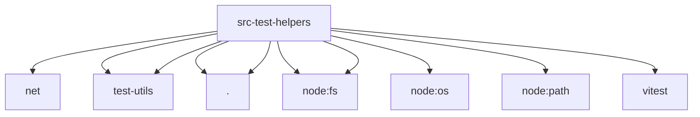

# Imports

[← Back to MODULE](MODULE.md) | [← Back to INDEX](../../INDEX.md)

## Dependency Graph

## External Dependencies

Dependencies from other modules:

- `../infra/net/hostname.js`
- `../test-utils/env.js`
- `../test-utils/session-state-cleanup.js`
- `./state-dir-env.js`
- `./temp-dir.js`
- `node:fs`
- `node:fs/promises`
- `node:os`
- `node:path`
- `vitest`
