# Imports

[← Back to MODULE](MODULE.md) | [← Back to INDEX](../../INDEX.md)

## Dependency Graph

```mermaid
graph TD
    src_transcripts[src-transcripts] --> src[src]
    src_transcripts[src-transcripts] --> infra[infra]
    src_transcripts[src-transcripts] --> helpers[helpers]
    src_transcripts[src-transcripts] --> plugins[plugins]
    src_transcripts[src-transcripts] --> plugins[plugins]
    src_transcripts[src-transcripts] --> _[.]
    src_transcripts[src-transcripts] --> _[.]
    src_transcripts[src-transcripts] --> normalization_core[normalization-core]
    src_transcripts[src-transcripts] --> normalization_core[normalization-core]
    src_transcripts[src-transcripts] --> normalization_core[normalization-core]
    src_transcripts[src-transcripts] --> node_fs[node:fs]
    src_transcripts[src-transcripts] --> node_fs[node:fs]
    src_transcripts[src-transcripts] --> node_path[node:path]
    src_transcripts[src-transcripts] --> node_readline[node:readline]
    src_transcripts[src-transcripts] --> node_stream[node:stream]
    src_transcripts[src-transcripts] --> vitest[vitest]
```

## External Dependencies

Dependencies from other modules:

- `../../packages/terminal-core/src/safe-text.js`
- `../../src/infra/open-file-descriptors.test-support.js`
- `../../test/helpers/temp-dir.js`
- `../plugins/capability-provider-runtime.js`
- `../plugins/provider-registry-shared.js`
- `./store.js`
- `./summary.js`
- `@openclaw/normalization-core/number-coercion`
- `@openclaw/normalization-core/string-coerce`
- `@openclaw/normalization-core/string-normalization`
- `node:fs`
- `node:fs/promises`
- `node:path`
- `node:readline`
- `node:stream`
- `vitest`
