# Imports

[← Back to MODULE](MODULE.md) | [← Back to INDEX](../../INDEX.md)

## Dependency Graph

```mermaid
graph TD
    src_tts[src-tts] --> speech_core[speech-core]
    src_tts[src-tts] --> agents[agents]
    src_tts[src-tts] --> agents[agents]
    src_tts[src-tts] --> infra[infra]
    src_tts[src-tts] --> plugins[plugins]
    src_tts[src-tts] --> plugins[plugins]
    src_tts[src-tts] --> plugins[plugins]
    src_tts[src-tts] --> routing[routing]
    src_tts[src-tts] --> secrets[secrets]
    src_tts[src-tts] --> shared[shared]
    src_tts[src-tts] --> text[text]
    src_tts[src-tts] --> test_utils[test-utils]
    src_tts[src-tts] --> __[..]
    src_tts[src-tts] --> _[.]
    src_tts[src-tts] --> _[.]
    src_tts[src-tts] --> _[.]
    src_tts[src-tts] --> _[.]
    src_tts[src-tts] --> _[.]
    src_tts[src-tts] --> _[.]
    src_tts[src-tts] --> _[.]
    src_tts[src-tts] --> _[.]
    src_tts[src-tts] --> _[.]
    src_tts[src-tts] --> _[.]
    src_tts[src-tts] --> normalization_core[normalization-core]
    src_tts[src-tts] --> normalization_core[normalization-core]
    src_tts[src-tts] --> normalization_core[normalization-core]
    src_tts[src-tts] --> normalization_core[normalization-core]
    src_tts[src-tts] --> node_fs[node:fs]
    src_tts[src-tts] --> node_os[node:os]
    src_tts[src-tts] --> node_path[node:path]
    src_tts[src-tts] --> plugin_sdk[plugin-sdk]
    src_tts[src-tts] --> plugin_sdk[plugin-sdk]
    src_tts[src-tts] --> vitest[vitest]
```

## External Dependencies

Dependencies from other modules:

- `../../packages/speech-core/runtime-api.js`
- `../agents/model-selection.js`
- `../agents/provider-http-errors.js`
- `../infra/deep-merge.js`
- `../plugins/active-runtime-registry.js`
- `../plugins/capability-provider-runtime.js`
- `../plugins/provider-registry-shared.js`
- `../routing/session-key.js`
- `../secrets/runtime-degraded-state.js`
- `../shared/number-coercion.js`
- `../shared/text/strip-markdown.js`
- `../test-utils/env.js`
- `../utils.js`
- `./directive-number.js`
- `./directives.js`
- `./openai-compatible-speech-provider.js`
- `./provider-registry-core.js`
- `./provider-registry.js`
- `./status-config.js`
- `./tts-auto-mode.js`
- `./tts-config.js`
- `./tts-core.js`
- `./tts-settings.js`
- `@openclaw/normalization-core/number-coercion`
- `@openclaw/normalization-core/record-coerce`
- `@openclaw/normalization-core/string-coerce`
- `@openclaw/normalization-core/utf16-slice`
- `node:fs`
- `node:os`
- `node:path`
- `openclaw/plugin-sdk/provider-http`
- `openclaw/plugin-sdk/secret-input`
- `vitest`
