# Imports

[← Back to MODULE](MODULE.md) | [← Back to INDEX](../../INDEX.md)

## Dependency Graph

```mermaid
graph TD
    src_worker[src-worker] --> src[src]
    src_worker[src-worker] --> src[src]
    src_worker[src-worker] --> schema[schema]
    src_worker[src-worker] --> schema[schema]
    src_worker[src-worker] --> src[src]
    src_worker[src-worker] --> agents[agents]
    src_worker[src-worker] --> agents[agents]
    src_worker[src-worker] --> agents[agents]
    src_worker[src-worker] --> agents[agents]
    src_worker[src-worker] --> run[run]
    src_worker[src-worker] --> agents[agents]
    src_worker[src-worker] --> sessions[sessions]
    src_worker[src-worker] --> sessions[sessions]
    src_worker[src-worker] --> sessions[sessions]
    src_worker[src-worker] --> sessions[sessions]
    src_worker[src-worker] --> sessions[sessions]
    src_worker[src-worker] --> sessions[sessions]
    src_worker[src-worker] --> agents[agents]
    src_worker[src-worker] --> sessions[sessions]
    src_worker[src-worker] --> ws_connection[ws-connection]
    src_worker[src-worker] --> worker_environments[worker-environments]
    src_worker[src-worker] --> worker_environments[worker-environments]
    src_worker[src-worker] --> worker_environments[worker-environments]
    src_worker[src-worker] --> worker_environments[worker-environments]
    src_worker[src-worker] --> worker_environments[worker-environments]
    src_worker[src-worker] --> worker_environments[worker-environments]
    src_worker[src-worker] --> worker_environments[worker-environments]
    src_worker[src-worker] --> infra[infra]
    src_worker[src-worker] --> infra[infra]
    src_worker[src-worker] --> infra[infra]
    src_worker[src-worker] --> utils[utils]
    src_worker[src-worker] --> supervisor[supervisor]
    src_worker[src-worker] --> state[state]
    src_worker[src-worker] --> utils[utils]
    src_worker[src-worker] --> _[.]
    src_worker[src-worker] --> _[.]
    src_worker[src-worker] --> _[.]
    src_worker[src-worker] --> _[.]
    src_worker[src-worker] --> _[.]
    src_worker[src-worker] --> _[.]
    src_worker[src-worker] --> _[.]
    src_worker[src-worker] --> _[.]
    src_worker[src-worker] --> _[.]
    src_worker[src-worker] --> _[.]
    src_worker[src-worker] --> _[.]
    src_worker[src-worker] --> internal[internal]
    src_worker[src-worker] --> node_crypto[node:crypto]
    src_worker[src-worker] --> node_fs[node:fs]
    src_worker[src-worker] --> node_http[node:http]
    src_worker[src-worker] --> node_os[node:os]
    src_worker[src-worker] --> node_path[node:path]
    src_worker[src-worker] --> typebox[typebox]
    src_worker[src-worker] --> vitest[vitest]
    src_worker[src-worker] --> ws[ws]
```

## External Dependencies

Dependencies from other modules:

- `../../packages/gateway-client/src/timeouts.js`
- `../../packages/gateway-protocol/src/client-info.js`
- `../../packages/gateway-protocol/src/schema/worker-admission.js`
- `../../packages/gateway-protocol/src/schema/worker-inference.js`
- `../../packages/gateway-protocol/src/version.js`
- `../agents/agent-tool-definition-adapter.js`
- `../agents/agent-tools.js`
- `../agents/bash-process-registry.js`
- `../agents/bootstrap-files.js`
- `../agents/embedded-agent-runner/run/setup.js`
- `../agents/session-tool-result-guard-wrapper.js`
- `../agents/sessions/auth-storage.js`
- `../agents/sessions/model-registry.js`
- `../agents/sessions/resource-loader.js`
- `../agents/sessions/sdk.js`
- `../agents/sessions/session-manager.js`
- `../agents/sessions/settings-manager.js`
- `../agents/workspace.js`
- `../config/sessions/session-accessor.js`
- `../gateway/server/ws-connection/worker-connection.js`
- `../gateway/worker-environments/credential.js`
- `../gateway/worker-environments/inference-store.js`
- `../gateway/worker-environments/live-events.js`
- `../gateway/worker-environments/service.js`
- `../gateway/worker-environments/store.js`
- `../gateway/worker-environments/transcript-commit-store.js`
- `../gateway/worker-environments/transcript-commit.js`
- `../infra/agent-events.js`
- `../infra/backoff.js`
- `../infra/ws.js`
- `../llm/utils/event-stream.js`
- `../process/supervisor/index.js`
- `../state/openclaw-state-db.js`
- `../utils/utf8-truncate.js`
- `./embedded-agent-live.runtime.js`
- `./embedded-agent-transcript.runtime.js`
- `./launch-descriptor.js`
- `./transcript-message.js`
- `./worker-connection-admission.js`
- `./worker-connection-contract.js`
- `./worker-connection-frames.js`
- `./worker-connection.js`
- `./worker-rpc-client-shared.js`
- `./worker-rpc-clients.js`
- `./worker.runtime.js`
- `@openclaw/ai/internal/runtime`
- `node:crypto`
- `node:fs/promises`
- `node:http`
- `node:os`
- `node:path`
- `typebox/value`
- `vitest`
- `ws`
