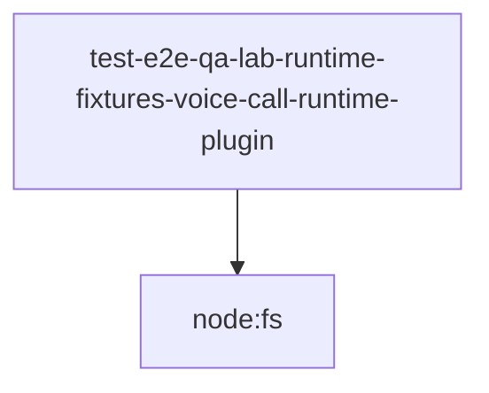

# Module: test/e2e/qa-lab/runtime/fixtures/voice-call-runtime-plugin

[← Back to INDEX](../../INDEX.md)

**Type:** js/ts | **Files:** 1

**Entry point:** `test/e2e/qa-lab/runtime/fixtures/voice-call-runtime-plugin/index.js`

## Files

| File | Lines | Large |
| ---- | ----- | ----- |
| `test/e2e/qa-lab/runtime/fixtures/voice-call-runtime-plugin/index.js` | 83 |  |

---

## External Dependencies

Dependencies from other modules:

- `node:fs`
