# Imports

[← Back to MODULE](MODULE.md) | [← Back to INDEX](../../INDEX.md)

## Dependency Graph

```mermaid
graph TD
    test_helpers_agents[test-helpers-agents] --> agents[agents]
    test_helpers_agents[test-helpers-agents] --> agents[agents]
    test_helpers_agents[test-helpers-agents] --> run[run]
    test_helpers_agents[test-helpers-agents] --> embedded_agent_runner[embedded-agent-runner]
    test_helpers_agents[test-helpers-agents] --> agents[agents]
    test_helpers_agents[test-helpers-agents] --> test_helpers[test-helpers]
    test_helpers_agents[test-helpers-agents] --> auto_reply[auto-reply]
    test_helpers_agents[test-helpers-agents] --> reply[reply]
    test_helpers_agents[test-helpers-agents] --> reply[reply]
    test_helpers_agents[test-helpers-agents] --> reply[reply]
    test_helpers_agents[test-helpers-agents] --> auto_reply[auto-reply]
    test_helpers_agents[test-helpers-agents] --> channels[channels]
    test_helpers_agents[test-helpers-agents] --> plugin_sdk[plugin-sdk]
    test_helpers_agents[test-helpers-agents] --> plugin_sdk[plugin-sdk]
    test_helpers_agents[test-helpers-agents] --> plugins[plugins]
    test_helpers_agents[test-helpers-agents] --> test_helpers[test-helpers]
    test_helpers_agents[test-helpers-agents] --> test_utils[test-utils]
    test_helpers_agents[test-helpers-agents] --> test_utils[test-utils]
    test_helpers_agents[test-helpers-agents] --> _[.]
    test_helpers_agents[test-helpers-agents] --> node_fs[node:fs]
    test_helpers_agents[test-helpers-agents] --> node_fs[node:fs]
    test_helpers_agents[test-helpers-agents] --> node_path[node:path]
    test_helpers_agents[test-helpers-agents] --> vitest[vitest]
```

## External Dependencies

Dependencies from other modules:

- `../../../src/agents/bootstrap-budget.js`
- `../../../src/agents/bootstrap-files.js`
- `../../../src/agents/embedded-agent-runner/run/runtime-context-prompt.js`
- `../../../src/agents/embedded-agent-runner/system-prompt.js`
- `../../../src/agents/system-prompt.js`
- `../../../src/agents/test-helpers/agent-tool-stubs.js`
- `../../../src/auto-reply/heartbeat.js`
- `../../../src/auto-reply/reply/groups.js`
- `../../../src/auto-reply/reply/inbound-meta.js`
- `../../../src/auto-reply/reply/prompt-prelude.js`
- `../../../src/auto-reply/tokens.js`
- `../../../src/channels/chat-type.js`
- `../../../src/plugin-sdk/agent-harness-runtime.js`
- `../../../src/plugin-sdk/agent-harness.js`
- `../../../src/plugins/runtime.js`
- `../../../src/test-helpers/workspace.js`
- `../../../src/test-utils/bundled-plugin-public-surface.js`
- `../../../src/test-utils/channel-plugins.js`
- `./prompt-snapshot-paths.js`
- `node:fs`
- `node:fs/promises`
- `node:path`
- `vitest`
