# Imports

[← Back to MODULE](MODULE.md) | [← Back to INDEX](../../INDEX.md)

## Dependency Graph

```mermaid
graph TD
    test_helpers_link_domain_fakes[test-helpers-link-domain-fakes] --> src[src]
    test_helpers_link_domain_fakes[test-helpers-link-domain-fakes] --> src[src]
    test_helpers_link_domain_fakes[test-helpers-link-domain-fakes] --> src[src]
    test_helpers_link_domain_fakes[test-helpers-link-domain-fakes] --> src[src]
    test_helpers_link_domain_fakes[test-helpers-link-domain-fakes] --> src[src]
    test_helpers_link_domain_fakes[test-helpers-link-domain-fakes] --> test_support[test-support]
    test_helpers_link_domain_fakes[test-helpers-link-domain-fakes] --> fake[fake]
    test_helpers_link_domain_fakes[test-helpers-link-domain-fakes] --> src[src]
    test_helpers_link_domain_fakes[test-helpers-link-domain-fakes] --> src[src]
    test_helpers_link_domain_fakes[test-helpers-link-domain-fakes] --> src[src]
    test_helpers_link_domain_fakes[test-helpers-link-domain-fakes] --> src[src]
    test_helpers_link_domain_fakes[test-helpers-link-domain-fakes] --> src[src]
    test_helpers_link_domain_fakes[test-helpers-link-domain-fakes] --> test_support[test-support]
    test_helpers_link_domain_fakes[test-helpers-link-domain-fakes] --> _[.]
    test_helpers_link_domain_fakes[test-helpers-link-domain-fakes] --> _[.]
    test_helpers_link_domain_fakes[test-helpers-link-domain-fakes] --> node_child_process[node:child_process]
    test_helpers_link_domain_fakes[test-helpers-link-domain-fakes] --> node_fs[node:fs]
    test_helpers_link_domain_fakes[test-helpers-link-domain-fakes] --> node_path[node:path]
    test_helpers_link_domain_fakes[test-helpers-link-domain-fakes] --> node_url[node:url]
    test_helpers_link_domain_fakes[test-helpers-link-domain-fakes] --> vitest[vitest]
```

## External Dependencies

Dependencies from other modules:

- `../../../extensions/linkbrain/src/config.js`
- `../../../extensions/linkbrain/src/namespaces.js`
- `../../../extensions/linkbrain/src/runtime.js`
- `../../../extensions/linkbrain/src/sanitize.js`
- `../../../extensions/linkbrain/src/stores.js`
- `../../../extensions/linkbrain/src/test-support/memory-store.js`
- `../../../extensions/linkskills/fake/service.mjs`
- `../../../extensions/linkskills/src/config.js`
- `../../../extensions/linkskills/src/envelopes.js`
- `../../../extensions/linkskills/src/namespaces.js`
- `../../../extensions/linkskills/src/runtime.js`
- `../../../extensions/linkskills/src/stores.js`
- `../../../extensions/linkskills/src/test-support/memory-store.js`
- `./brain-fake.js`
- `./skills-fake.js`
- `node:child_process`
- `node:fs`
- `node:path`
- `node:url`
- `vitest`
