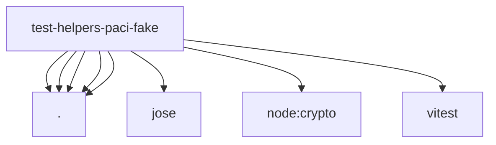

# Imports

[← Back to MODULE](MODULE.md) | [← Back to INDEX](../../INDEX.md)

## Dependency Graph

## External Dependencies

Dependencies from other modules:

- `./constants.js`
- `./keys.js`
- `./metadata.js`
- `./scope.js`
- `./server.js`
- `jose`
- `node:crypto`
- `vitest`
