# Imports

[← Back to MODULE](MODULE.md) | [← Back to INDEX](../../INDEX.md)

## Dependency Graph

```mermaid
graph TD
    test_vitest[test-vitest] --> acp_core[acp-core]
    test_vitest[test-vitest] --> lib[lib]
    test_vitest[test-vitest] --> lib[lib]
    test_vitest[test-vitest] --> lib[lib]
    test_vitest[test-vitest] --> lib[lib]
    test_vitest[test-vitest] --> _[.]
    test_vitest[test-vitest] --> _[.]
    test_vitest[test-vitest] --> _[.]
    test_vitest[test-vitest] --> _[.]
    test_vitest[test-vitest] --> _[.]
    test_vitest[test-vitest] --> _[.]
    test_vitest[test-vitest] --> _[.]
    test_vitest[test-vitest] --> _[.]
    test_vitest[test-vitest] --> _[.]
    test_vitest[test-vitest] --> _[.]
    test_vitest[test-vitest] --> _[.]
    test_vitest[test-vitest] --> _[.]
    test_vitest[test-vitest] --> _[.]
    test_vitest[test-vitest] --> _[.]
    test_vitest[test-vitest] --> _[.]
    test_vitest[test-vitest] --> _[.]
    test_vitest[test-vitest] --> _[.]
    test_vitest[test-vitest] --> _[.]
    test_vitest[test-vitest] --> _[.]
    test_vitest[test-vitest] --> _[.]
    test_vitest[test-vitest] --> _[.]
    test_vitest[test-vitest] --> _[.]
    test_vitest[test-vitest] --> _[.]
    test_vitest[test-vitest] --> _[.]
    test_vitest[test-vitest] --> _[.]
    test_vitest[test-vitest] --> _[.]
    test_vitest[test-vitest] --> _[.]
    test_vitest[test-vitest] --> _[.]
    test_vitest[test-vitest] --> _[.]
    test_vitest[test-vitest] --> _[.]
    test_vitest[test-vitest] --> _[.]
    test_vitest[test-vitest] --> _[.]
    test_vitest[test-vitest] --> _[.]
    test_vitest[test-vitest] --> _[.]
    test_vitest[test-vitest] --> _[.]
    test_vitest[test-vitest] --> _[.]
    test_vitest[test-vitest] --> _[.]
    test_vitest[test-vitest] --> _[.]
    test_vitest[test-vitest] --> _[.]
    test_vitest[test-vitest] --> _[.]
    test_vitest[test-vitest] --> _[.]
    test_vitest[test-vitest] --> node_child_process[node:child_process]
    test_vitest[test-vitest] --> node_fs[node:fs]
    test_vitest[test-vitest] --> node_module[node:module]
    test_vitest[test-vitest] --> node_os[node:os]
    test_vitest[test-vitest] --> node_path[node:path]
    test_vitest[test-vitest] --> node_url[node:url]
    test_vitest[test-vitest] --> vitest[vitest]
```

## External Dependencies

Dependencies from other modules:

- `../../packages/acp-core/package.json`
- `../../scripts/lib/bundled-plugin-paths.mjs`
- `../../scripts/lib/plugin-sdk-entries.mjs`
- `../../scripts/lib/plugin-sdk-private-local-only-subpaths.json`
- `../../scripts/lib/vitest-local-scheduling.mjs`
- `./vitest.agents-paths.mjs`
- `./vitest.bundled-plugin-paths.ts`
- `./vitest.channel-paths.mjs`
- `./vitest.commands-light-paths.mjs`
- `./vitest.config.ts`
- `./vitest.contracts-shared.ts`
- `./vitest.extension-acpx-paths.mjs`
- `./vitest.extension-active-memory-paths.mjs`
- `./vitest.extension-browser-paths.mjs`
- `./vitest.extension-channel-single-config.ts`
- `./vitest.extension-channel-split-paths.mjs`
- `./vitest.extension-codex-paths.mjs`
- `./vitest.extension-diffs-paths.mjs`
- `./vitest.extension-feishu-paths.mjs`
- `./vitest.extension-irc-paths.mjs`
- `./vitest.extension-matrix-paths.mjs`
- `./vitest.extension-mattermost-paths.mjs`
- `./vitest.extension-media-paths.mjs`
- `./vitest.extension-memory-paths.mjs`
- `./vitest.extension-messaging-paths.mjs`
- `./vitest.extension-misc-paths.mjs`
- `./vitest.extension-msteams-paths.mjs`
- `./vitest.extension-provider-paths.mjs`
- `./vitest.extension-qa-paths.mjs`
- `./vitest.extension-telegram-paths.mjs`
- `./vitest.extension-voice-call-paths.mjs`
- `./vitest.extension-whatsapp-paths.mjs`
- `./vitest.extension-zalo-paths.mjs`
- `./vitest.pattern-file.ts`
- `./vitest.performance-config.ts`
- `./vitest.plugin-sdk-paths.mjs`
- `./vitest.project-shard-config.ts`
- `./vitest.scoped-config.ts`
- `./vitest.shared.config.ts`
- `./vitest.system-load.ts`
- `./vitest.test-shards.mjs`
- `./vitest.tooling-docker.config.ts`
- `./vitest.tooling-isolated-paths.mjs`
- `./vitest.unit-fast-paths.mjs`
- `./vitest.unit-paths.mjs`
- `./vitest.unit.config.ts`
- `node:child_process`
- `node:fs`
- `node:module`
- `node:os`
- `node:path`
- `node:url`
- `vitest/config`
