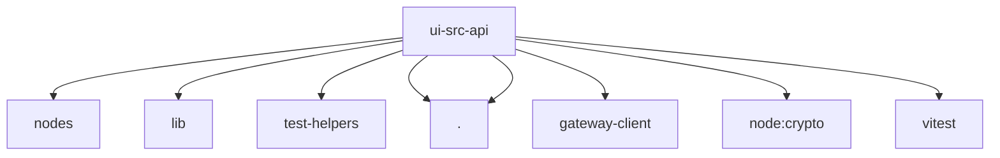

# Imports

[← Back to MODULE](MODULE.md) | [← Back to INDEX](../../INDEX.md)

## Dependency Graph

## External Dependencies

Dependencies from other modules:

- `../lib/nodes/index.ts`
- `../lib/uuid.ts`
- `../test-helpers/storage.ts`
- `./gateway-browser-auth.ts`
- `./gateway-browser-socket.ts`
- `@openclaw/gateway-client/browser`
- `node:crypto`
- `vitest`
