# Imports

[← Back to MODULE](MODULE.md) | [← Back to INDEX](../../INDEX.md)

## Dependency Graph

```mermaid
graph TD
    ui_src_components_terminal[ui-src-components-terminal] --> shared[shared]
    ui_src_components_terminal[ui-src-components-terminal] --> i18n[i18n]
    ui_src_components_terminal[ui-src-components-terminal] --> lit[lit]
    ui_src_components_terminal[ui-src-components-terminal] --> test_helpers[test-helpers]
    ui_src_components_terminal[ui-src-components-terminal] --> test_helpers[test-helpers]
    ui_src_components_terminal[ui-src-components-terminal] --> __[..]
    ui_src_components_terminal[ui-src-components-terminal] --> __[..]
    ui_src_components_terminal[ui-src-components-terminal] --> __[..]
    ui_src_components_terminal[ui-src-components-terminal] --> _[.]
    ui_src_components_terminal[ui-src-components-terminal] --> _[.]
    ui_src_components_terminal[ui-src-components-terminal] --> _[.]
    ui_src_components_terminal[ui-src-components-terminal] --> _[.]
    ui_src_components_terminal[ui-src-components-terminal] --> _[.]
    ui_src_components_terminal[ui-src-components-terminal] --> _[.]
    ui_src_components_terminal[ui-src-components-terminal] --> _[.]
    ui_src_components_terminal[ui-src-components-terminal] --> _[.]
    ui_src_components_terminal[ui-src-components-terminal] --> _[.]
    ui_src_components_terminal[ui-src-components-terminal] --> _[.]
    ui_src_components_terminal[ui-src-components-terminal] --> _[.]
    ui_src_components_terminal[ui-src-components-terminal] --> _[.]
    ui_src_components_terminal[ui-src-components-terminal] --> _[.]
    ui_src_components_terminal[ui-src-components-terminal] --> _[.]
    ui_src_components_terminal[ui-src-components-terminal] --> lit[lit]
    ui_src_components_terminal[ui-src-components-terminal] --> lit[lit]
    ui_src_components_terminal[ui-src-components-terminal] --> vitest[vitest]
```

## External Dependencies

Dependencies from other modules:

- `../../../../src/shared/bounded-buffer.ts`
- `../../i18n/index.ts`
- `../../lit/openclaw-element.ts`
- `../../test-helpers/storage.ts`
- `../../test-helpers/wait-for.ts`
- `../dock-panel-layout.ts`
- `../panel-tab-strip.ts`
- `../panel-toggle-contract.ts`
- `./terminal-connection.ts`
- `./terminal-file-upload.ts`
- `./terminal-panel-styles.ts`
- `./terminal-panel-tabs.ts`
- `./terminal-panel-upload-styles.ts`
- `./terminal-panel-upload.ts`
- `./terminal-panel.ts`
- `./terminal-runtime.ts`
- `./terminal-session-picker.ts`
- `./terminal-session-storage.ts`
- `./terminal-startup-input.ts`
- `./terminal-tab-readiness.ts`
- `./terminal-task-queue.ts`
- `./terminal-theme.ts`
- `lit`
- `lit/decorators.js`
- `vitest`
