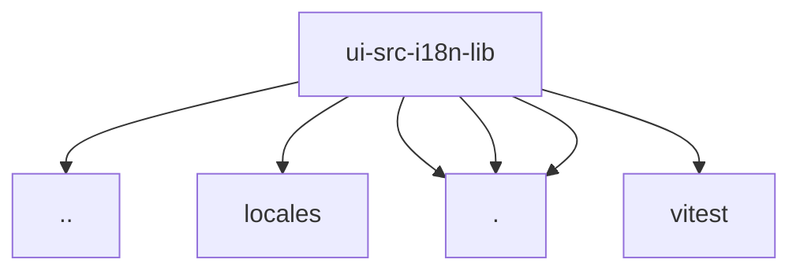

# Imports

[← Back to MODULE](MODULE.md) | [← Back to INDEX](../../INDEX.md)

## Dependency Graph

## External Dependencies

Dependencies from other modules:

- `../../local-storage.ts`
- `../locales/en.ts`
- `./lit-controller.ts`
- `./registry.ts`
- `./translate.ts`
- `vitest`
